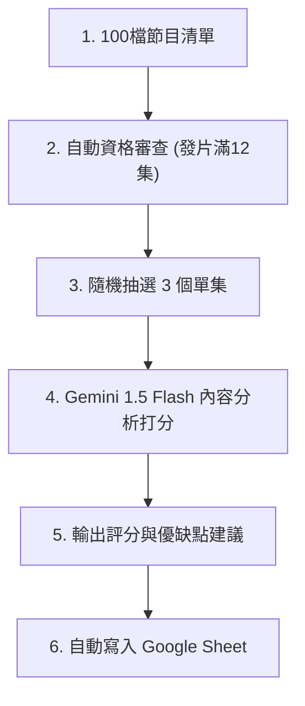
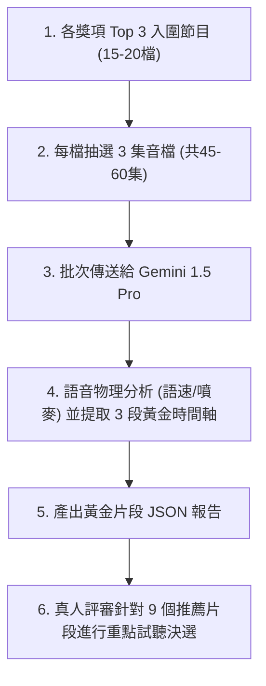
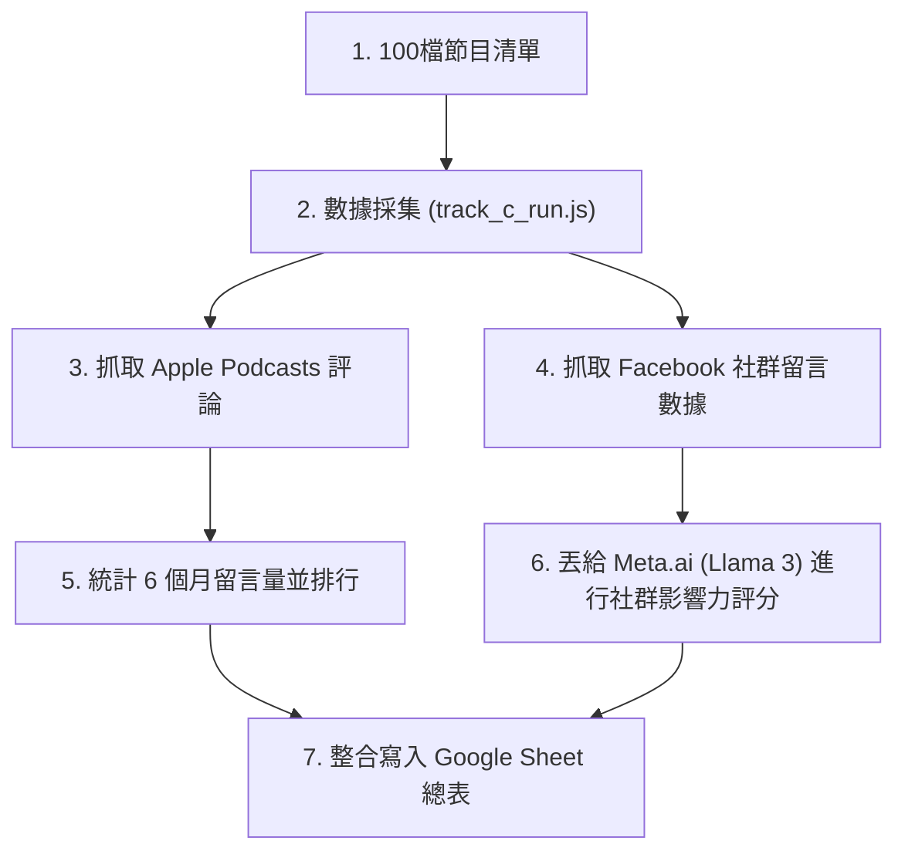

# SDH Award Podcast AI 評選工作流與時程成本規劃書 (Updated)

本規劃書專為**「無程式背景、每天限用筆電執行 2 小時」**的硬體與時間限制所設計。為確保筆電不發熱、不卡頓，且能在 1 小時內全自動完成，本方案推薦採用 **「雲端 API 直聽免轉寫」** 的架構。

---

## 🏆 獎項與評選軌道對照表 (Award-to-Track Mapping Matrix)

大賽的所有獎項已根據其屬性（文字、聲音、外部數據）進行了精準的分軌，避免混淆：

| 評選軌道 | 負責任務屬性 | 對應評估之大賽獎項 | 評估依據與數據源 |
| :--- | :--- | :--- | :--- |
| 🪶 **軌道 A** (逐字稿文本分析軌) | **分析「節目內容與架構」** 著重在文字邏輯、企劃創意與主持人的內容引導。 | 1. **【最佳內容架構獎】** 2. **【最神企劃獎】** 3. **【動滋動滋獎/推坑王獎 (CTA)】** 4. **【稀有保護動物獎/小眾市場獎】** 5. **【自我探索獎】** 6. **【時間很短獎/泡麵沒熟獎】** | **單集逐字稿 (ASR Text)** 透過 AI 閱讀逐字稿進行深度的文本架構、創意與結尾呼籲分析。 |
| ♊ **軌道 B** (聲音物理診斷軌) | **分析「節目製播與聲音」** 著重在主持人的發音、語速、音調起伏與雙人接話默契。 | 1. **【好聽好聽獎/耳朵懷孕獎】** 2. **【最佳默契雙人/多人組獎】** 3. **【背景超乾淨獎/錄音品質獎】** | **單集原始音檔 (Audio MP3)** 透過 Gemini 1.5 Pro 直聽音檔，進行物理特徵分析並定位黃金推薦片段。 |
| 📊 **軌道 C** (社群擴散與數據軌) | **分析「外部傳播與社群」** 著重在聽眾主動回饋（評論留言）與社群傳播熱度。 | 1. **【欸我跟你獎/社群分享力獎】** 2. **【熱心觀眾獎/留言王獎】** | **聽眾評論與 FB 社群數據** 抓取 Apple Podcasts 真實聽眾評論，並利用 Meta.ai 分析 FB 推廣文案留言熱度。 |

---

## 🎯 複審決選：各獎項 Top 3 聲音診斷與黃金 3 片段規劃

當軌道 A 與 C 評選出各獎項 of **Top 3 入圍名單**後（去重後約為 **15 至 20 檔節目**），我們針對這批「入圍決選節目」進行深度的聲音物理診斷與黃金時間軸提取。

為了更全面且客觀地評估主持人的聲音特質與節目表現，**每個入圍節目需要評估 3 個不同單集，且每一集均由 AI 建議 3 段黃金試聽片段**（即每個入圍節目將提供共 9 段黃金片段，供真人評審針對重點進行試聽）。

### 1. 執行工具：Gemini 1.5 Pro API (直聽音檔)
*   **為什麼適合您**：雖然每檔節目評估集數增加至 3 集（總計約 45 至 60 集），但由於我們將音檔網址直接送給 Gemini 1.5 Pro 進行雲端並行處理，因此**依然能在 10 分鐘左右全自動分析完畢**，完全不佔用您本機的運算資源。
*   **預估成本**：Gemini 1.5 Pro 音訊 API 費率為 $0.0075 美元/分鐘。
    *   `60 集 × 40 分鐘 = 2400 分鐘`
    *   `總花費 = 2400 × 0.0075 = $18.00 美元` (約 **新台幣 580 元**)，仍在非常經濟實惠的範圍。

### 2. AI 診斷內容 (寫入 JSON/試算表)
我們要求 Gemini 針對入圍節目所選出的**每一集**輸出以下結構化欄位：
*   **【聲音特徵與音調建議】**：分析主持人的語速（字/分鐘）、音調波動、噴麥/雜音情況，並提供聲音製播建議。
*   **【每集最建議聽的 3 段時間軸】**：針對該單集，精確定位出 **3 段最值得聽的 3 分鐘精華區間**，並說明原因：
    1.  **片段 A (如 12:15 - 15:15)**：【內容火花段】（此段訪談問題切入極深，來賓分享了未曾公開的故事）。
    2.  **片段 B (如 22:30 - 25:30)**：【默契流暢段】（雙人互動極為自然，包含一次溫馨的共鳴笑聲）。
    3.  **片段 C (如 38:00 - 41:00)**：【陪伴療癒段】（語速降至 180 字/分，語氣平穩誠懇，具備強大治癒感）。

### 3. 人類終審 Google Sheet 呈現方式 (真人評審聽重點)
評審不需盲聽 15-20 檔節目共 30-40 小時的原始音檔，只需打開試算表：
*   點選各獎項頁面，查看 Top 3 節目（每個節目 3 集，每集 3 片段，共 9 片段）。
*   點擊試算表內提供的 **[播放片段 A]**、**[播放片段 B]**、**[播放片段 C]** 連結，只聽 3 分鐘精華。
*   真人評審在 **每檔節目 10-15 分鐘** 的聽評過程中即可做出極具信服力的最終評審決定。

---

## 三軌評估時間、成本與負載矩陣 (以 240 集 / 80 檔節目計算)

| 評估軌道 | 推薦實作做法 (對無背景筆電用戶最佳) | 預估執行時間 | 預估資金成本 (新台幣) | 筆電硬體負載 |
| :--- | :--- | :--- | :--- | :---: |
| **軌道 A** (逐字稿文本分析) | **Gemini 1.5 Flash API 雲端直聽打分** 直接將 240 集 MP3 音檔網址傳給 Gemini，免去轉寫步驟，AI 在雲端邊聽邊評分。 | **30 ~ 45 分鐘** (並行處理) | **約 NT$ 400 元** (按音訊分鐘計費) | **0%** (雲端運算) |
| **複審決選** (各獎項 Top 3 診斷) | **Gemini 1.5 Pro API 聲音特徵與片段提取** 針對各獎項 **Top 3 入圍節目**（約 15-20 檔），**每檔評估 3 集**（共 45-60 集音檔）進行音質、默契診斷與每集各 3 段黃金時間軸提取。 | **8 ~ 12 分鐘** (並行處理) | **約 NT$ 430 ~ 580 元** (按音訊分鐘計費) | **0%** (雲端運算) |
| **軌道 C** (外部數據與社群) | **Node.js 輕量爬蟲工具** 一鍵調用 Apple Podcasts Reviews API 與 Spotify 網頁抓取評分。 | **2 分鐘內** | **NT$ 0 元** (完全免費) | **1%** (微量頻寬) |
| **總計** | **一鍵啟動自動化流程** | **60 分鐘內跑完** | **約 NT$ 830 ~ 980 元** | **安全不發熱** |

---

## 🪶 軌道 A：逐字稿文本分析與企劃軌 (Mermaid 流程圖)

此軌道專注於「節目內容架構與企劃」，包含自動化資格審查、音檔下載、雲端 ASR 文本轉寫與評分。

---

## ♊ 軌道 B：音檔物理特徵分析與診斷軌 (Mermaid 流程圖)

此軌道評估聲音的物理特性、主持人默契與雜訊。在複審決選階段，針對各獎項 Top 3 節目，評估其隨機抽取的 3 個單集（每集定位 3 個推薦片段，共 9 片段）。

---

## 📊 軌道 C：外部數據與社群軌 (Mermaid 流程圖)

此軌道聚焦於社群擴散與聽眾反饋。為避免 Spotify 等平台的網頁爬蟲被 IP 阻擋，**目前 MVP 階段僅全自動抓取 Apple Podcasts 的公開評論**，並結合 Facebook 推廣貼文的自然留言進行 Meta.ai 講評。

<!-- tab-split -->

# 📌 專案執行現況與 Demo 成果彙整 (2026-06-14 節點)

目前本系統的「Demo 概念驗證」與「自動化數據採集」已成功上線，各模組進度如下：

### 1. 資格審查與合格集數池 (完成 ✅)
*   **Demo 資料源**：以您的 Google 試算表 24 檔節目清單為範本。
*   **執行腳本**：[build_episode_pool.js](file:///C:/Users/manma/OneDrive/Documents/Antigrivity/SDH%20Award/build_episode_pool.js)
*   **成果**：
    *   成功過濾出 **16 檔合格節目** (符合 6 個月發片滿 12 集門檻)。
    *   順利排除 8 檔已停更或更新頻率不足的節目（如《聽進理投》、《媽媽好神經病》）。
    *   自動建立包含 **733 個單集的完整資料庫** [eligible_episodes_pool.csv](file:///C:/Users/manma/OneDrive/Documents/Antigrivity/SDH%20Award/eligible_episodes_pool.csv)，為後續隨機抽樣奠定基礎。

### 2. 軌道 B 聲音物理測試環境 (完成 ✅)
*   **執行腳本**：[track_b_run.js](file:///C:/Users/manma/OneDrive/Documents/Antigrivity/SDH%20Award/track_b_run.js)
*   **成果**：已寫好完整 API 對接流程（音檔下載 -> 上傳 Gemini Files API -> Pro 模型語音打分與 3 段黃金片段定位）。金鑰申請與設定方式已在 [README.md](file:///C:/Users/manma/OneDrive/Documents/Antigrivity/SDH%20Award/README.md) 中完整指引。

### 3. 軌道 C 聽眾留言量排行榜 (完成 ✅)
*   **執行腳本**：[track_c_run.js](file:///C:/Users/manma/OneDrive/Documents/Antigrivity/SDH%20Award/track_c_run.js)
*   **成果**：完全免付費，成功爬取 16 檔合格節目的聽眾留言數並進行排行。
    *   *例：【美股航海王】13 筆留言奪冠；【哇賽心理學】7 筆留言居次，且自動節錄了真實的語意評論。*

### 4. 軌道 C 百大榜單「每日底層封存」系統 (啟動 ✅)
*   **執行腳本**：[daily_ranking_logger.js](file:///C:/Users/manma/OneDrive/Documents/Antigrivity/SDH%20Award/daily_ranking_logger.js)
*   **排程設定**：已在 Windows 系統成功註冊每日定時工作 `SDH_Podcast_Daily_Ranking_Logger`（每天早上 10:00 自動執行，若關機則開機後補跑）。
*   **成果**：每日自動抓取 Apple Podcasts 台灣區完整 Top 100 榜單，寫入 [daily_top100_archive.csv](file:///C:/Users/manma/OneDrive/Documents/Antigrivity/SDH%20Award/daily_top100_archive.csv)。
    *   *此做法可防範未來參賽清單有新節目加入時，能夠溯及既往地查詢其在榜歷史天數與名次。*

### 📋 MVP 測試與待辦清單 (MVP Testing To-Do List)

目前系統處於 MVP（最小可行性產品）驗證階段，各模組測試與待辦狀態如下：

*   **[x] 資格審查與合格集數池 (`build_episode_pool.js`)**：已測試，完成 16 檔合格節目篩選，產出 733 集集數池。
*   **[x] 軌道 B 聲音物理測試 (`track_b_run.js`)**：已測試，使用單一短音檔成功完成 Files API 上傳、語速分析、噴麥檢測與黃金片段提取。
*   **[x] 軌道 C Apple Podcasts 評論抓取 (`track_c_run.js`)**：已測試，成功全自動抓取並產出留言排行榜。
*   **[x] 軌道 C 百大榜單每日封存排程 (`daily_ranking_logger.js`)**：已測試，成功註冊 Windows 每日 10:00 自動執行任務。
*   **[ ] 軌道 A 內容企劃大批量打分測試 (待辦 ⏳)**：尚未撰寫大批量 MP3 轉 Flash API 打分腳本。
*   **[ ] 決選隨機抽樣系統 (`draw_samples.js` 或整合功能) (待辦 ⏳)**：尚未撰寫自動化抽樣程式。
*   **[ ] 軌道 B 80 檔節目大批量 (240 集) 聲音物理評估測試 (待辦 ⏳)**：
    *   *評估設計*：若要將全體 80 檔節目皆進行軌道 B 聲音物理評定（每檔 3 集，共 240 集音檔），系統將透過 Node.js 進行批次上傳（分流並行）。
    *   *預估處理時間*：約 **25 ~ 35 分鐘**（全雲端運算，本機 0 負載，僅需等待上傳頻寬）。
    *   *預估 API 成本*：`80 檔 × 3 集 × 40 分鐘/集 = 9,600 分鐘`，`9,600 分鐘 × $0.0075 美元 = $72.00 美元`（約 **新台幣 2,300 元**）。
*   **[ ] 終審 Google Sheets 儀表板自動化整合 (待辦 ⏳)**：尚未撰寫將三軌數據合併自動填入 Google Sheets 的 Google Apps Script 或 Node 腳本。

<!-- tab-split -->

# ⏳ 專案開發與進程時間軸 (Project Timeline)

這裡記錄了 SDH Award Podcast AI 評選系統 the 開發動態與更新日誌，按日期排序，越新的動態顯示在最上方。

---

### 📅 2026-06-15 (主題：軌道三 (Meta.AI) 儀表板整合與版面優化)
*   **📊 軌道 C (Meta.AI) 社群聲量大數據整合**
    *   **異動內容**：將 Meta.ai 評選出的「鬧鐘獎［欸我跟你獎］社群聲量總講評」HTML 動態報告，完全整合至本規劃書網頁中，作為獨立的第三頁籤 **「📊 軌道 C 社群聲量」**。
    *   **版面優化**：主版面升級為 **「三頁籤 -> 四頁籤」**（規劃書/現況/社群聲量/時間軸），並優化行動端按鈕顯示。
    *   **數據補正**：針對社群聲量表單進行結構修復，補齊 `<thead>` 中的 **「建議執行動作」** 標題列，修復資料欄位對齊問題。

---

### 📅 2026-06-14 (主題：軌道建立與 MVP Demo 測試)
*   **♊ 軌道 B 決選打分邏輯升級**
    *   **異動內容**：為提高評審的客觀性，將各獎項 Top 3 入圍節目的評估方式，由「僅評估 1 個單集（產出 3 段黃金片段）」調整為**「每檔節目評估 3 個單集，每集建議 3 段黃金片段（共 9 段精華片段）」**。
    *   **連動更新**：重新估算複審 API 的預算（NT$ 430 ~ 580 元）及總體執行時間（小於 60 分鐘），更新規劃書數據。
*   **⚙️ 每日排行日誌 logger 啟動**
    *   成功部署 `daily_ranking_logger.js` 排程腳本，並在 Windows 系統註冊 `SDH_Podcast_Daily_Ranking_Logger` 每日工作排程，每天早上 10:00 自動下載封存 Apple Podcasts 台灣區完整 Top 100 榜單。
*   **📊 軌道 C 聽眾留言量排行榜上線**
    *   完成 `track_c_run.js` 開發，透過 Apple Podcasts Reviews API 成功抓取 16 檔合格節目的聽眾留言數並進行排行。
*   **♊ 軌道 B 聲音物理特徵測試成功**
    *   完成 `track_b_run.js` 開發，順利對接 Gemini Files API 進行 MP3 音檔上傳、分析語調語速，並成功定位黃金 3 分鐘。
*   **🔍 資格審查與合格集數池建立**
    *   完成 `build_episode_pool.js` 開發，以 6 個月發片滿 12 集為門檻，從 24 檔節目中篩選出 16 檔合格節目，並建立 733 集的合格集數池資料庫（`eligible_episodes_pool.csv`）。
*   **🌐 建議書靜態網頁與 Git 儲存庫建立**
    *   建立 `generate_html.js` 自動化 HTML 轉換工具。
    *   設定專案 GitHub 遠端儲存庫，成功推送首版規劃書並準備啟用 GitHub Pages 固定網址。

---

### 📅 2026-06-13
*   **🏗️ 專案初始化與三軌架構設計**
    *   確定 SDH Award 的評選軌道對照表（軌道 A 文本分析、軌道 B 聲音物理、軌道 C 外部社群數據）。
    *   設計無程式背景、限用筆電 2 小時、0 發熱的「雲端 API 直聽」核心架構。
