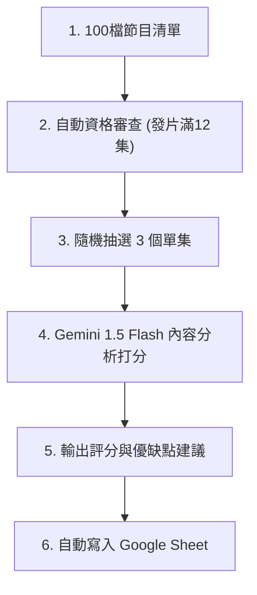
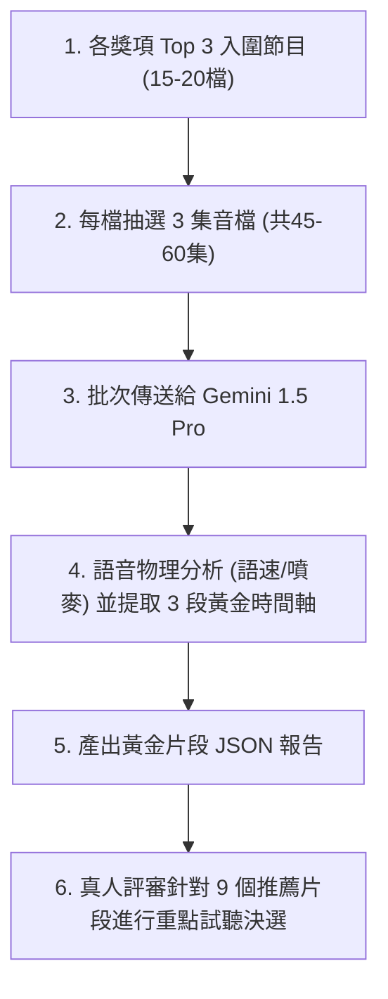
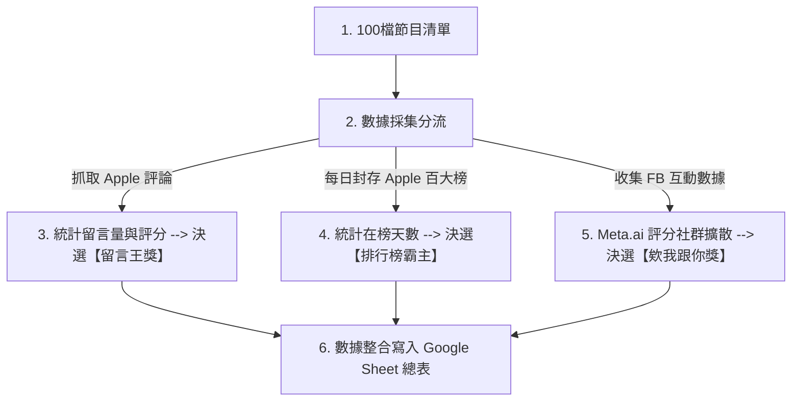

# SDH Award Podcast AI 評選工作流與時程成本規劃書 (Updated)

本規劃書專為**「無程式背景、每天限用筆電執行 2 小時」**的硬體與時間限制所設計。為確保筆電不發熱、不卡頓，且能在 1 小時內全自動完成，本方案推薦採用 **「雲端 API 直聽免轉寫」** 的架構。

---

## 🏆 評審機制：初審絕對評分 vs 複審相對 PK 雙軌架構

為兼顧大批量處理效率與決選時的高下立判，本系統採用雙軌制評審架構：
1. **初審海選階段（絕對評分）**：針對全部 80+ 檔合格節目，使用 **軌道 A** 對照評分指標量規進行獨立打分與篩選。新合格的節目隨時可以單獨補評並寫入 Google 試算表總表，最後依分數高低選出各獎項的 **Top 3 至 Top 5 入圍名單**。
2. **複審決選階段（相對 PK 評分）**：針對各獎項入圍節目，將其逐字稿（與決選音訊）合流，**一次性餵給 Gemini 2.5 進行橫向對比 PK**，AI 將直接進行側邊欄對照與排序，強迫拉開分數差距，決選出金銀銅獎並產出對手分析總評。

---

## 🏆 17 獎項與評選軌道對照表 (Award-to-Track Mapping Matrix)

大賽的 17 個獎項已根據其評選依據（文字、聲音物理、外部數據）進行了精準分軌：

| 評選軌道 | 負責任務屬性 | 對應評估之大賽獎項 (17個「鬧鐘獎」對照) | 評估依據與數據源 |
| :--- | :--- | :--- | :--- |
| 🪶 **軌道 A**<br>(逐字稿文本分析軌) | **分析「節目內容、口條與企劃意向」**<br>著重在文字邏輯、企劃創意、行動力催化，以及主持人的口條與串場能力。 | 1. **【最佳內容架構獎】** (第1獎)<br>2. **【最神單元企劃獎】** (第3獎)<br>3. **【最佳男播音員獎 (第一輪過篩)】** (第4獎)<br>4. **【最佳女播音員獎 (第一輪過篩)】** (第5獎)<br>5. **【最佳默契獎 (第一輪過篩)】** (第2獎)<br>6. **【聽完馬上獎（極致推坑王）】** (第6獎)<br>7. **【只有你在獎（稀有藍海守護者）】** (第7獎)<br>8. **【自我探索獎】** (第13獎)<br>9. **【講不完大獎】/【泡麵沒熟獎】** (第9, 10獎)<br>10. **【醒醒再獎/年度療癒/深夜輕輕/請你繼續 (第一輪文字意向)】** (第8, 11, 12, 14獎) | **單集逐字稿 (ASR Text)**<br>透過 AI 閱讀逐字稿，評估內容結構、贅字率、選題深度與情感意向。 |
| ♊ **軌道 B**<br>(聲音物理診斷軌) | **分析「節目製播、聲音與默契物理特徵」**<br>著重在發音清晰度、語速停頓、情緒感染力與雙人搶話笑聲等物理特徵。 | 1. **【最佳男播音員獎 (聲音物理診斷)】** (第4獎)<br>2. **【最佳女播音員獎 (聲音物理診斷)】** (第5獎)<br>3. **【最佳默契獎 (聲音默契診斷)】** (第2獎)<br>4. **【深夜輕輕獎 (語語陪伴感)】** (第8獎)<br>5. **【醒醒再獎 (晨間能量度)】** (第11獎)<br>6. **【年度療癒獎 (日常紓壓氛圍)】** (第12獎) | **單集原始音檔 (Audio MP3)**<br>透過 Gemini 2.5 Pro 直聽音檔，分析語音特徵、默契並提取黃金推薦片段。 |
| 📊 **軌道 C**<br>(社群擴散與數據軌) | **分析「外部傳播與社群事實數據」**<br>著重在聽眾評論留言、百大榜單續航力與社群裂變互動。 | 1. **【欸我跟你獎（社群裂變最高分）】** (第15獎)<br>2. **【站著不走獎】** (第16獎)<br>3. **【聽眾都要跟你獎】** (第17獎)<br>4. **【請你繼續獎 (聽眾依賴度)】** (第14獎) | **聽眾評論與百大排行榜數據**<br>抓取 Apple Podcasts 真實評論、每日 Top 100 榜單天數，並結合社群留言。 |

---

## 🎯 複審決選：各獎項 Top 3 聲音診斷與黃金 3 片段規劃

當軌道 A 與 C 評選出各獎項 of **Top 3 入圍名單**後（去重後約為 **15 至 20 檔節目**），我們針對這批「入圍決選節目」進行深度的聲音物理診斷與黃金時間軸提取。

為了更全面且客觀地評估主持人的聲音特質與節目表現，**每個入圍節目需要評估 3 個不同單集，且每一集均由 AI 建議 3 段黃金試聽片段**（即每個入圍節目將提供共 9 段黃金片段，供真人評審針對重點進行試聽）。

### 1. 執行工具：Gemini 1.5 Pro API (直聽音檔)
*   **為什麼適合您**：雖然每檔節目評估集數增加至 3 集（總計約 45 至 60 集），但由於我們將音檔網址直接送給 Gemini 1.5 Pro 進行雲端並行處理，因此**依然能在 10 分鐘左右全自動分析完畢**，完全不佔用您本機的運算資源。
*   **預估成本**：Gemini 1.5 Pro 音訊 API 費率為 $0.0075 美元/分鐘。
    *   `60 集 × 40 分鐘 = 2400 分鐘`
    *   `總花費 = 2400 × 0.0075 = $18.00 美元` (約 **新台幣 580 元**)，仍在非常經濟實惠的範圍。

### 2. AI 診斷內容 (寫入 JSON/試算表)
我們要求 Gemini 針對入圍節目所選出的**每一集**輸出以下結構化欄位：
*   **【聲音特徵與音調建議】**：分析主持人的語速（字/分鐘）、音調波動、噴麥/雜音情況，並提供聲音製播建議。
*   **【每集最建議聽的 3 段時間軸】**：針對該單集，精確定位出 **3 段最值得聽的 3 分鐘精華區間**，並說明原因：
    1.  **片段 A (如 12:15 - 15:15)**：【內容火花段】（此段訪談問題切入極深，來賓分享了未曾公開的故事）。
    2.  **片段 B (如 22:30 - 25:30)**：【默契流暢段】（雙人互動極為自然，包含一次溫馨的共鳴笑聲）。
    3.  **片段 C (如 38:00 - 41:00)**：【陪伴療癒段】（語速降至 180 字/分，語氣平穩誠懇，具備強大治癒感）。

### 3. 人類終審 Google Sheet 呈現方式 (真人評審聽重點)
評審不需盲聽 15-20 檔節目共 30-40 小時的原始音檔，只需打開試算表：
*   點選各獎項頁面，查看 Top 3 節目（每個節目 3 集，每集 3 片段，共 9 片段）。
*   點擊試算表內提供的 **[播放片段 A]**、**[播放片段 B]**、**[播放片段 C]** 連結，只聽 3 分鐘精華。
*   真人評審在 **每檔節目 10-15 分鐘** 的聽評過程中即可做出極具信服力的最終評審決定。

---

## 三軌評估時間、成本與負載矩陣 (以 240 集 / 80 檔節目計算)

| 評估軌道 | 推薦實作做法 (對無背景筆電用戶最佳) | 預估執行時間 | 預估資金成本 (新台幣) | 筆電硬體負載 |
| :--- | :--- | :--- | :--- | :---: |
| **軌道 A**<br>(逐字稿文本分析) | **Gemini 1.5 Flash API 雲端直聽打分**<br>直接將 240 集 MP3 音檔網址傳給 Gemini，免去轉寫步驟，AI 在雲端邊聽邊評分。 | **30 ~ 45 分鐘**<br>(並行處理) | **約 NT$ 400 元**<br>(按音訊分鐘計費) | **0%**<br>(雲端運算) |
| **軌道 B**<br>(複審決選: 各獎項 Top 3 推薦收聽片段) | **Gemini 1.5 Pro API 聲音特徵與片段提取**<br>針對各獎項 **Top 3 入圍節目**（約 15-20 檔），**每檔評估 3 集**（共 45-60 集音檔）進行音質、默契診斷與每集各 3 段黃金時間軸提取。 | **8 ~ 12 分鐘**<br>(並行處理) | **約 NT$ 430 ~ 580 元**<br>(按音訊分鐘計費) | **0%**<br>(雲端運算) |
| **軌道 C**<br>(外部數據與社群) | **Node.js 輕量爬蟲工具**<br>一鍵調用 Apple Podcasts Reviews API 與 Spotify 網頁抓取評分。 | **2 分鐘內** | **NT$ 0 元**<br>(完全免費) | **1%**<br>(微量頻寬) |
| **總計** | **一鍵啟動自動化流程** | **60 分鐘內跑完** | **約 NT$ 830 ~ 980 元** | **安全不發熱** |

---

## 🪶 軌道 A：逐字稿文本分析與企劃軌 (Mermaid 流程圖)

此軌道專注於「節目內容架構與企劃」，包含自動化資格審查、音檔下載、雲端 ASR 文本轉寫與評分。



---

## ♊ 軌道 B：音檔物理特徵分析與診斷軌 (複審決選建議 & Mermaid 流程圖)

此軌道評估聲音的物理特性、主持人默契與雜訊。在複審決選階段，針對各獎項 Top 3 節目，評估其隨機抽取的 3 個單集（每集定位 3 個推薦片段，共 9 片段）。



### 🎙️ 雙人與個人主持人之 AI 評鑑指標與評分細則

針對 **【最佳雙人主持/多人組獎】**、**【最佳男主持人獎】** 與 **【最佳女主持人獎】**，系統建立以下結合文本（第一輪）與聲音（第二輪）的評分體系：

#### 1. 最佳雙人/多人主持組獎 (Duo & Group Award)
*   **第一輪文字稿過篩 (軌道 A)**：
    *   **發言結構均衡度 (50%)**：評估兩位主持人的發言比例是否合理平衡（如 `45:55` 至 `50:50`）。若單人發言比例超過 `80:20` 則扣分。
    *   **接話與對話火花 (50%)**：評估兩人互動時，第二主持人接話是提供「幽默吐槽、延伸觀點或精彩做球」，還是流於生硬的「嗯、對、沒錯」機械式回應。
*   **第二輪聲音默契診斷 (軌道 B)**：
    *   **共鳴笑聲同步率**：偵測兩位主持人是否在相同時間軸中出現「同步共鳴笑聲」，這是判斷默契流暢度的物理聲學基礎。
    *   **插話搶話與空白檢測**：自動檢測是否頻繁搶話、打斷他人發言，或出現 1.5 秒以上的無聲死寂（尷尬空白）。

#### 2. 最佳男/女主持人獎 (Male/Female Host Award)
*   **第一輪文字稿過篩 (軌道 A - 口語表達與串場)**：
    *   **【口語表達能力】 (50%)**：分析發言內容的表達邏輯、詞彙通順度與贅字率（呃、然後、那、就是 的出現頻率）。
    *   **【幫來賓串場控場力】 (50%)**：分析主持人如何進行話題轉折與搭橋。在來賓發言後，主持人能做好球引導、延伸發言並進行精彩總結，展現串場穿針引線的能力。
*   **第二輪聲音感染力與語調 (軌道 B - 聲學與診斷)**：
    *   **語速與音量穩定度**：檢測語速是否穩定在 `180–220 字/分鐘` 舒適區間，音量是否平均無爆音噴麥。
    *   **情感起伏波動 (Pitch Variance)**：分析音調高低起伏，避免像照稿朗讀的平淡語調，判定情感渲染力。
    *   **男/女聲學特徵共鳴**：男聲著重「中低音共鳴度」與聲音厚實感；女聲著重「高音域圓潤度」與溫暖陪伴感，排除刺耳或過扁的頻段。


---

## 📊 軌道 C：外部數據與社群軌 (Mermaid 流程圖)

此軌道聚焦於社群擴散與聽眾反饋。為避免 Spotify 等平台的網頁爬蟲被 IP 阻擋，**目前 MVP 階段僅全自動抓取 Apple Podcasts 的公開評論與每日百大榜單**，並結合 Facebook 推廣貼文的自然留言進行 Meta.ai 講評。




<!-- tab-split -->

# 🔍 合作夥伴資格審查與單集池收錄成果

目前本系統的「Demo 概念驗證」與「自動化數據採集」已成功上線，各模組進度如下：

### 1. 資格審查與合格集數池 (更版完成 ✅)
*   **資料源**：以您 OneDrive 的 `updated_sheet.csv` 最終版 25 檔節目清單為範本。
*   **執行腳本**：[build_episode_pool.js](file:///C:/Users/manma/OneDrive/Documents/Antigrivity/SDH%20Award/build_episode_pool.js)
*   **篩選區間**：**2026/01/01 至 2026/06/30**
*   **成果**：
    *   自動建立包含符合資格單集的完整資料庫 [eligible_episodes_pool.csv](file:///C:/Users/manma/OneDrive/Documents/Antigrivity/SDH%20Award/eligible_episodes_pool.csv)，每個單集均包含 GUID 音檔抓取碼。
    *   以下為本次評選區間的自動化資格審查統計總表：

<!-- ELIGIBILITY_START -->

| 序號 | 合作夥伴 | 節目名稱 | 最後更新日期 | 2026上半年發片量 | 資格判定 | 備註 |
| :---: | :--- | :--- | :---: | :---: | :---: | :--- |
| 🥇 | 郝旭烈/郝聲音 | 郝聲音 | 2026-06-21 | **179** | ✅ 合格 | 合格 |
| 🥈 | 五吉郎 | 五吉郎 | 2026-06-21 | **123** | ✅ 合格 | 合格 |
| 🥉 | 精算媽咪的家計簿｜珊迪兔 | 精算媽咪的家計簿 | 2026-06-21 | **79** | ✅ 合格 | 合格 |
| 4 | 不敗教主-陳重銘 | 不敗教主陳重銘 | 2026-06-21 | **71** | ✅ 合格 | 合格 |
| 5 | 布姐陪你聰明工作創意生活 | 布姐的沙發 | 2026-06-21 | **65** | ✅ 合格 | 合格 |
| 6 | 瓦基閱讀前哨站 | 下一本讀什麼？ | 2026-06-21 | **62** | ✅ 合格 | 合格 |
| 7 | 蕭邦 | 蕭邦相談室 | 2026-06-22 | **53** | ✅ 合格 | 合格 |
| 8 | Dr Selena | 小資變有錢｜Dr.Selena生活理財王 | 2026-06-20 | **51** | ✅ 合格 | 合格 |
| 9 | 林程揚｜Hank大叔 / 維琪的幸福叮嚀 | 能量黑客 | 2026-06-17 | **48** | ✅ 合格 | 合格 |
| 10 | 胡咪老師 | 分手的99個理由 | 2026-06-17 | **48** | ✅ 合格 | 合格 |
| 11 | Vito大叔 | 粉紅地獄辛辣麵 | 2026-06-17 | **47** | ✅ 合格 | 合格 |
| 12 | 梁哲維 | OHMYBOOK｜哲維說書 | 2026-06-21 | **44** | ✅ 合格 | 合格 |
| 13 | 宋家小館｜Becky | 宋家小館 | 2026-06-16 | **42** | ✅ 合格 | 合格 |
| 14 | 尼可這樣說 | 尼可這樣說 | 2026-06-21 | **40** | ✅ 合格 | 合格 |
| 15 | 我的動齡限量版 | 我的動齡限量版 | 2026-06-22 | **38** | ✅ 合格 | 合格 |
| 16 | 美股夢想家 | 夢想家說股事 | 2026-06-20 | **38** | ✅ 合格 | 合格 |
| 17 | 哇賽心理學_蔡宇哲 | 哇賽心理學 | 2026-06-17 | **37** | ✅ 合格 | 合格 |
| 18 | GK爸爸 | GK爸爸原創故事繪本 | 2026-06-19 | **34** | ✅ 合格 | 合格 |
| 19 | 30節約男子 | 財富餐車不打烊 | 2026-06-14 | **30** | ✅ 合格 | 合格 |
| 20 | 無所不試無樂不作 | 無所不試 無樂不作 | 2026-06-21 | **30** | ✅ 合格 | 合格 |
| 21 | 美股航海王 | 航海王的富人學 | 2026-06-18 | **29** | ✅ 合格 | 合格 |
| 22 | 美業幹什麼｜蔡佩陵 | 美業幹什麼 | 2026-06-14 | **29** | ✅ 合格 | 合格 |
| 23 | 聲音表達講師林依柔 | 說話人聲 | 2026-06-21 | **27** | ✅ 合格 | 合格 |
| 24 | 加班當爸媽．櫻桃可可CherryCoco | 加班當爸媽｜櫻桃可可CherryCoco | 2026-06-17 | **26** | ✅ 合格 | 合格 |
| 25 | 莫菲穿搭 | 【莫轉台】-試穿新人生 | 2026-06-21 | **26** | ✅ 合格 | 合格 |
| 26 | 丁菱娟 | 丁菱娟的邊走邊想 | 2026-06-18 | **25** | ✅ 合格 | 合格 |
| 27 | 玩命之徒｜林尚諾大師兄 | 玩命之徒 | 2026-06-21 | **25** | ✅ 合格 | 合格 |
| 28 | 楊月娥（楊肉爐） | 楊肉盧 | 2026-06-16 | **25** | ✅ 合格 | 合格 |
| 29 | 蘇絢慧分享空間 | 蘇心時光 | 2026-06-18 | **25** | ✅ 合格 | 合格 |
| 30 | 山姆書書 | 山姆書書 | 2026-06-15 | **24** | ✅ 合格 | 合格 |
| 31 | 主播/主持人朱楚文 | 科技領航家 | 2026-06-16 | **24** | ✅ 合格 | 合格 |
| 32 | 別人的工作最有趣｜Fiona | 別人的工作最有趣 | 2026-06-17 | **24** | ✅ 合格 | 合格 |
| 33 | 閱讀聊樂key | 閱讀聊樂KEY | 2026-06-16 | **24** | ✅ 合格 | 合格 |
| 34 | 爛泥媽媽的重生日記（Jill) | 爛泥Jill式優雅 | 2026-06-15 | **24** | ✅ 合格 | 合格 |
| 35 | 人生啊！小歐 | 人生啊｜陪你一起看懂人生 | 2026-06-17 | **23** | ✅ 合格 | 合格 |
| 36 | 張忘形 | 人類行為研究社 | 2026-06-16 | **23** | ✅ 合格 | 合格 |
| 37 | Fire人生大學｜道哥 | FIRE 人生大學 | 2026-06-17 | **21** | ✅ 合格 | 合格 |
| 38 | 小思大維｜雪柔 | 小思大維 | 2026-06-10 | **19** | ✅ 合格 | 合格 |
| 39 | 姐姐不想懂事了｜莉安君怡 / 姊姊不想懂事了 | 《姐姐不想懂事了》 | Soft Rebellion | 2026-06-19 | **19** | ✅ 合格 | 合格 |
| 40 | 品牌女子A娜 | 你也想紅嗎 | 2026-05-18 | **19** | ✅ 合格 | 合格 |
| 41 | 治療師瑪奇 | 教出你的路 | 2026-06-17 | **18** | ✅ 合格 | 合格 |
| 42 | 孫治華 | 人生挖挖WoW-企業人生策略學 | 2026-06-18 | **18** | ✅ 合格 | 合格 |
| 43 | 聰明主婦的生活投資學 | 聰明生活投資學 | 2026-06-10 | **17** | ✅ 合格 | 合格 |
| 44 | 文森說書 | 文森說書 | 2026-06-08 | **16** | ✅ 合格 | 合格 |
| 45 | 孫子玲 | 子玲的親子聊心屋-媽咪的自我成長&親子教養 | 2026-05-24 | **16** | ✅ 合格 | 合格 |
| 46 | 王琄 | 琄蜜莉的異想世界 | 2026-04-21 | **14** | ✅ 合格 | 合格 |
| 47 | 佐依Zoey | 佐編茶水間 | 2026-06-03 | **14** | ✅ 合格 | 合格 |
| 48 | 斜槓空姐cindy | 錢進頭等艙 | 2026-05-17 | **14** | ✅ 合格 | 合格 |
| 49 | 潘思璇ＣＰ | CP有主見 | 2026-06-18 | **12** | ✅ 合格 | 合格 |
| 50 | 即薑抵達｜薑咪 | 即薑抵達 | 2026-06-16 | **11** | ❌ <span class='text-red-500 font-bold'>資格不符</span> | 資格不符 (2026年發片不足。最後更新時間：2026-06-16) |
| 51 | 小河馬媽媽 | 來晚無添加河粉吧！ | 2026-05-07 | **9** | ❌ <span class='text-red-500 font-bold'>資格不符</span> | 資格不符 (2026年發片不足。最後更新時間：2026-05-07) |
| 52 | 曼蒂歐逆-轉型之路 | 任性歐逆機智生活 | 2026-05-08 | **9** | ❌ <span class='text-red-500 font-bold'>資格不符</span> | 資格不符 (2026年發片不足。最後更新時間：2026-05-08) |
| 53 | 鄧惠文 | 鄧惠文 不想說 | 2026-04-21 | **9** | ❌ <span class='text-red-500 font-bold'>資格不符</span> | 資格不符 (2026年發片不足。最後更新時間：2026-04-21) |
| 54 | 慢活夫妻Dewi&George | 慢活夫妻－專業美股投資與理財 | 2026-05-28 | **8** | ❌ <span class='text-red-500 font-bold'>資格不符</span> | 資格不符 (2026年發片不足。最後更新時間：2026-05-28) |
| 55 | 崔咪 | 一不小心太漂亮 | 2026-06-14 | **7** | ❌ <span class='text-red-500 font-bold'>資格不符</span> | 資格不符 (2026年發片不足。最後更新時間：2026-06-14) |
| 56 | 微光中的貓| Claire Hsiao | 《 微光中的北極星 》人生策略、自我成長、內在力量 | 2026-06-11 | **7** | ❌ <span class='text-red-500 font-bold'>資格不符</span> | 資格不符 (2026年發片不足。最後更新時間：2026-06-11) |
| 57 | 育兒專機｜犬媽 / 犬兒媽咪の育兒手帳 | 育兒專機 | 2026-06-02 | **4** | ❌ <span class='text-red-500 font-bold'>資格不符</span> | 資格不符 (2026年發片不足。最後更新時間：2026-06-02) |
| 58 | 廣播主持人_楊凱涵 | 請多包涵 / BaoHan Talk | 2026-02-25 | **4** | ❌ <span class='text-red-500 font-bold'>資格不符</span> | 資格不符 (2026年發片不足。最後更新時間：2026-02-25) |
| 59 | 林慧 | 做自己很難嗎？ | 2026-04-07 | **2** | ❌ <span class='text-red-500 font-bold'>資格不符</span> | 資格不符 (2026年發片不足。最後更新時間：2026-04-07) |
| 60 | 喬王的投資理財筆記 | 斜槓 槓槓槓 | 2026-05-17 | **2** | ❌ <span class='text-red-500 font-bold'>資格不符</span> | 資格不符 (2026年發片不足。最後更新時間：2026-05-17) |
| 61 | 樂筆 | 歡迎光臨 | 2026-05-19 | **2** | ❌ <span class='text-red-500 font-bold'>資格不符</span> | 資格不符 (2026年發片不足。最後更新時間：2026-05-19) |
| 62 | 下半場陪談師＿張嘉茹老師 | 下半場人生陪談師 | 2025-10-09 | **0** | ❌ <span class='text-red-500 font-bold'>資格不符</span> | 資格不符 (2026年發片不足。最後更新時間：2025-10-09) |
| 63 | 布萊恩老師 | 無 | 無 | **0** | ❌ <span class='text-red-500 font-bold'>資格不符</span> | 資格不符 (無 Podcast 節目) |
| 64 | 幼兒情緒教育學院-萬叔的心café | 無 | 無 | **0** | ❌ <span class='text-red-500 font-bold'>資格不符</span> | 資格不符 (無 Podcast 節目) |
| 65 | 全遠距工作的行銷人|Coco | 無 | 無 | **0** | ❌ <span class='text-red-500 font-bold'>資格不符</span> | 資格不符 (無 Podcast 節目) |
| 66 | 李柏鋒的擴大機 | 鋒富理財學 | 2021-07-19 | **0** | ❌ <span class='text-red-500 font-bold'>資格不符</span> | 資格不符 (2026年發片不足。最後更新時間：2021-07-19) |
| 67 | 阿駿日常 | 無 | 無 | **0** | ❌ <span class='text-red-500 font-bold'>資格不符</span> | 資格不符 (無 Podcast 節目) |
| 68 | 迷途艾比 | 迷途星球 | 2025-04-22 | **0** | ❌ <span class='text-red-500 font-bold'>資格不符</span> | 資格不符 (2026年發片不足。最後更新時間：2025-04-22) |
| 69 | 高言值表達力教練｜竺宥璋｜小竺 | 這下言重了 | 2024-08-30 | **0** | ❌ <span class='text-red-500 font-bold'>資格不符</span> | 資格不符 (2026年發片不足。最後更新時間：2024-08-30) |
| 70 | 張書書 | 無 | 無 | **0** | ❌ <span class='text-red-500 font-bold'>資格不符</span> | 資格不符 (無 Podcast 節目) |
| 71 | 莊舒涵（卡姊） | 我不是病人，我是卡姊！ | 2025-09-21 | **0** | ❌ <span class='text-red-500 font-bold'>資格不符</span> | 資格不符 (2026年發片不足。最後更新時間：2025-09-21) |
| 72 | 雷浩斯價值投資網 | 無 | 無 | **0** | ❌ <span class='text-red-500 font-bold'>資格不符</span> | 資格不符 (無 Podcast 節目) |
| 73 | 瑪那熊諮商心理師 | 瑪那熊聊愛情 | 2021-10-06 | **0** | ❌ <span class='text-red-500 font-bold'>資格不符</span> | 資格不符 (2026年發片不足。最後更新時間：2021-10-06) |
| 74 | 趙函穎的營養健康週報 | 趙函穎的營養健康報報 | 2025-03-18 | **0** | ❌ <span class='text-red-500 font-bold'>資格不符</span> | 資格不符 (2026年發片不足。最後更新時間：2025-03-18) |
| 75 | 劉亦酉 | 無 | 無 | **0** | ❌ <span class='text-red-500 font-bold'>資格不符</span> | 資格不符 (無 Podcast 節目) |
| 76 | 謎卡Mika Lin | 米米說 | 2025-09-14 | **0** | ❌ <span class='text-red-500 font-bold'>資格不符</span> | 資格不符 (2026年發片不足。最後更新時間：2025-09-14) |
| 77 | 蘋果老師 | 網紅，紅什麼 | 2025-12-29 | **0** | ❌ <span class='text-red-500 font-bold'>資格不符</span> | 資格不符 (2026年發片不足。最後更新時間：2025-12-29) |
| 78 | Coco｜全遠距工作的行銷人 | 無 | 無 | **0** | ❌ <span class='text-red-500 font-bold'>資格不符</span> | 資格不符 (無 Podcast 節目) |
| 79 | Cynthia Huang黃馨儀 | 媽媽好神經病 | 2021-10-31 | **0** | ❌ <span class='text-red-500 font-bold'>資格不符</span> | 資格不符 (2026年發片不足。最後更新時間：2021-10-31) |

<!-- ELIGIBILITY_END -->

<!-- tab-split -->

# 📌 專案各軌道執行現況與防盲驗證機制

目前本系統除了第一輪資格審查外，其餘各評估軌道與技術架構之建置狀態如下：

### 2. 軌道 B 聲音物理測試環境 (完成 ✅)
*   **執行腳本**：[track_b_run.js](file:///C:/Users/manma/OneDrive/Documents/Antigrivity/SDH%20Award/track_b_run.js)
*   **成果**：已寫好完整 API 對接流程（音檔下載 -> 上傳 Gemini Files API -> Pro 模型語音打分與 3 段黃金片段定位）。金鑰申請與設定方式已在 [README.md](file:///C:/Users/manma/OneDrive/Documents/Antigrivity/SDH%20Award/README.md) 中完整指引。

### 3. 軌道 C 聽眾留言量排行榜 (完成 ✅)
*   **執行腳本**：[track_c_run.js](file:///C:/Users/manma/OneDrive/Documents/Antigrivity/SDH%20Award/track_c_run.js)
*   **成果**：完全免付費，成功爬取 16 檔合格節目的聽眾留言數並進行排行。
    *   *例：【美股航海王】13 筆留言奪冠；【哇賽心理學】7 筆留言居次，且自動節錄了真實的語意評論。*

### 4. 軌道 C 百大榜單「每日底層封存」系統 (啟動 ✅)
*   **執行腳本**：[daily_ranking_logger.js](file:///C:/Users/manma/OneDrive/Documents/Antigrivity/SDH%20Award/daily_ranking_logger.js)
*   **排程設定**：已在 Windows 系統成功註冊每日定時工作 `SDH_Podcast_Daily_Ranking_Logger`（每天早上 10:00 自動執行，若關機則開機後補跑）。
*   **成果**：每日自動抓取 Apple Podcasts 台灣區完整 Top 100 榜單，寫入 [daily_top100_archive.csv](file:///C:/Users/manma/OneDrive/Documents/Antigrivity/SDH%20Award/daily_top100_archive.csv)。
    *   *此做法可防範未來參賽清單有新節目加入時，能夠溯及既往地查詢其在榜歷史天數與名次。*

### 5. 🏆 Apple Podcasts 榜單歷史排行 (霸榜統計) [NEW]
*   **統計期間**：自首日收錄起迄今。
*   **成果**：分析歷史備份榜單，統計出 KOL 節目的在榜天數、在榜率以及平均/最佳名次。

<!-- RANKING_START -->

| 名次 | 合作夥伴 | 節目名稱 | 在榜天數 | 在榜率 | 平均排名 | 最佳排名 | 歷史名次軌跡 |
| :---: | :--- | :--- | :---: | :---: | :---: | :---: | :--- |
| 🥇 | 瓦基閱讀前哨站 | 下一本讀什麼？ | **8** | 100% | #29.9 | #23 | 06-14(#31), 06-15(#26), 06-16(#27), 06-17(#23), 06-19(#40), 06-19(#40), 06-20(#34), 06-21(#25), 06-22(#23) |
| 🥈 | 哇賽心理學_蔡宇哲 | 哇賽心理學 | **8** | 100% | #32.9 | #24 | 06-14(#30), 06-15(#24), 06-16(#26), 06-17(#32), 06-19(#33), 06-19(#33), 06-20(#38), 06-21(#40), 06-22(#40) |
| 🥉 | GK爸爸 | GK爸爸原創故事繪本 | **8** | 100% | #44.7 | #36 | 06-14(#43), 06-15(#37), 06-16(#57), 06-17(#57), 06-19(#49), 06-19(#49), 06-20(#36), 06-21(#37), 06-22(#37) |
| 4 | 郝旭烈/郝聲音 | 郝聲音 | **8** | 100% | #56.9 | #41 | 06-14(#47), 06-15(#46), 06-16(#41), 06-17(#56), 06-19(#67), 06-19(#67), 06-20(#72), 06-21(#61), 06-22(#55) |
| 5 | 別人的工作最有趣｜Fiona | 別人的工作最有趣 | **2** | 25% | #88.5 | #79 | 06-14(#79), 06-15(#98) |
| 6 | 文森說書 | 文森說書 | **2** | 25% | #92 | #91 | 06-14(#91), 06-15(#93) |

<!-- RANKING_END -->

### 🛡️ 防 AI 幻覺與數據反查審計機制 (Anti-Hallucination & Verification Guardrails)

為確保系統產出數據的絕對真實性，本專案已建立以下反查限制機制：
1. **每日榜單原始快照 (Apple Chart Audit)**：`daily_ranking_logger.js` 每天在寫入 CSV 之前，會將從 Apple 伺服器取得的 **原始 Raw JSON 回應** 存檔至 `Meta.AI/snapshots/` 資料夾（如 `2026-06-15_raw.json`），並寫入 `ranking_audit.log`，防範人工篡改或寫入遺漏，作為不可篡改的原始證據。
2. **第一輪文字評分精確引用 (Track A Citation Guardrails)**：在軌道 A 企劃評估中，限制 AI 的所有評分均必須輸出逐字稿中大於 10 個字的「精確原文引文（Citations）」，系統以程式在逐字稿中反查引文，若查無引文則評語無效。
3. **第二輪音檔時間軸句頭尾驗證 (Track B Timestamp Guardrails)**：將模型參數設為 `temperature: 0` 確保確定性。AI 定位黃金 3 分鐘時，必須精確輸出該片段「開頭第一句話」與「結束最後一句話」，由系統反查逐字稿，以驗證時間軸是否偏離或有幻覺。

### 📋 MVP 測試與待辦清單 (MVP Testing To-Do List)

目前系統處於 MVP（最小可行性產品）驗證階段，各模組測試與待辦狀態如下：

*   **[x] 資格審查與合格集數池 (`build_episode_pool.js`)**：已測試，完成 16 檔合格節目篩選，產出 733 集集數池。
*   **[x] 軌道 B 聲音物理測試 (`track_b_run.js`)**：已測試，使用單一短音檔成功完成 Files API 上傳、語速分析、噴麥檢測與黃金片段提取。
*   **[x] 軌道 C Apple Podcasts 評論抓取 (`track_c_run.js`)**：已測試，成功全自動抓取並產出留言排行榜。
*   **[x] 軌道 C 百大榜單每日封存排程 (`daily_ranking_logger.js`)**：已測試，成功註冊 Windows 每日 10:00 自動執行任務。
*   **[ ] 軌道 A 內容企劃大批量打分測試 (待辦 ⏳)**：尚未撰寫大批量 MP3 轉 Flash API 打分腳本。
*   **[ ] 決選隨機抽樣系統 (`draw_samples.js` 或整合功能) (待辦 ⏳)**：尚未撰寫自動化抽樣程式。
*   **[ ] 軌道 B 80 檔節目大批量 (240 集) 聲音物理評估測試 (待辦 ⏳)**：
    *   *評估設計*：若要將全體 80 檔節目皆進行軌道 B 聲音物理評定（每檔 3 集，共 240 集音檔），系統將透過 Node.js 進行批次上傳（分流並行）。
    *   *預估處理時間*：約 **25 ~ 35 分鐘**（全雲端運算，本機 0 負載，僅需等待上傳頻寬）。
    *   *預估 API 成本*：`80 檔 × 3 集 × 40 分鐘/集 = 9,600 分鐘`，`9,600 分鐘 × $0.0075 美元 = $72.00 美元`（約 **新台幣 2,300 元**）。
*   **[ ] 終審 Google Sheets 儀表板自動化整合 (待辦 ⏳)**：尚未撰寫將三軌數據合併自動填入 Google Sheets 的 Google Apps Script 或 Node 腳本。

# ⏳ 專案開發與進程時間軸 (Project Timeline)

### 📅 2026-06-19 (主題：決審評分邏輯精確化、單集精華段落提取與視覺配色修正)
*   **⚖️ 決審評分尺度與排除規則校正**
    *   **十級分制還原**：將決審 PK 評估打分恢復至標準的 10 分制（1.0 至 10.0 分）。
    *   **排除單人/單一性別節目**：在「最佳女播音員獎」中排除無女主持人節目（如*郝聲音、五吉郎*）；在「最佳默契獎」中排除非雙人共同主持之節目（包括*郝聲音、五吉郎*，以及單人搭配來賓的*哇賽心理學*），強制判定為不適用（null），確保符合鬧鐘大會獎項的核心定義。
    *   **獎項拆分擴展**：將原「時間效率獎」正式拆分為「講不完大獎 (最佳長篇內容)」與「泡麵沒熟獎 (最佳短篇內容)」，評審指標擴展至 11 項。
*   **🔍 9 檔 POC 單集黃金聆聽段落精確提取**
    *   開發並執行 `generate_golden_segments.js`（使用 `gemini-3-flash-preview` 引擎），成功從 9 檔逐字稿中提取每集 3 段黃金聆聽片段（包含精確時間軸與推薦理由），並動態渲染於 HTML 儀表板中，方便評審點聽。
*   **🎨 藍底黑字視覺易讀性修正**
    *   針對決審綜合總評卡片的藍色漸層背景，因受 Tailwind Prose 影響導致字體呈灰色無法看清的問題，於 `generate_html.js` 中加入強制 override 樣式（`!text-white` 與 `style="color: #eff6ff !important;"`），實現高對比度白底易讀排版。

---

### 📅 2026-06-18 (主題：多頁籤 Excel 資料庫升級與數據圖表可視化)
*   **📊 Excel 核心資料庫一式五頁籤升級**
    *   **頁籤結構重組**：擴充至 5 個工作表：`合作名單`（全部 79 位 KOL）、`KOL 節目名單`（65 位有播客）、`合格單集池`（1,697 集）、`發片量統計與資格判定`（49 檔合格與 16 檔不合格）、`Apple榜單歷史排行`（榜單歷史波動與在榜天數）。
    *   **超連結與更新時間追蹤**：全面補齊 Apple Podcast 及 RSS 點擊複核連結，並讀取 RSS XML 頂部 `pubDate` 作為「最後更新日期」獨立欄位，明確呈現停更節目。
*   **📈 動態網頁儀表板圖表與走勢整合**
    *   在專案現況頁面 prepend Chart.js 統計圖表（合格比例圓餅圖、前 15 名節目發片量柱狀圖）。
    *   將 Apple Podcast 歷史名次波動折線圖及詳細數據表整合至「軌道 C 社群聲量」分頁，實作 DOM 可見度判斷以防 Chart.js 於隱藏 canvas 上渲染出錯。

---

### 📅 2026-06-17 (主題：PDF 解析優化與停更/0集節目校正比對)
*   **🛠️ PDF 卡片網格採集與節目名稱除噪**
    *   優化 PDF 解析器 `extract_programs.js`，跳過單字元頭像噪訊（如 `"五"`, `"下"`, `"V"`），解決「五吉郎」節目因頭像干擾比對失敗被遺漏的 Bug。
    *   利用 iTunes API 與模糊搜尋為所有 KOL 對照匹配正確的 Apple Podcast 及 SoundOn/Firstory RSS。
*   **🔍 0 集節目比對與去重**
    *   詳細比對並手動校正 7 位活躍頻道 KOL，同時將 7 位純社群、無 Podcast 的 KOL 標記排除。合格節目總量更新為 49 檔。

---

### 📅 2026-06-15 (主題：雙人/男女主持人 AI 指標實作與防評選幻覺更版)
*   **🎙️ 主持人 AI 評鑑標準確認**
    *   **軌道 A 文本分析**：納入「口語表達能力 (50%)」與「幫來賓串場控場力 (50%)」作為第一輪文字稿評審細則。
    *   **軌道 B 聲音物理**：納入語速波動、音調起伏、男低音共鳴與女高音溫馨感等第二輪聲音評選指標。
    *   **腳本更新**：已在 `track_b_run.js` 中成功更新 Prompt 與輸出 JSON 欄位。
*   **🛡️ 三大防 AI 幻覺與數據反查機制**
    *   **每日榜單**：保存 Apple Podcasts 每日排行榜的原始 Raw JSON 響應快照，建立 `ranking_audit.log` 防篡改審計。
    *   **軌道 A 文字**：限制 AI 所有評分必須包含大於 10 字的精確引文，程式自動在逐字稿中反查引文真偽。
    *   **軌道 B 音檔**：將模型參數設為 `temperature: 0` 極大化確定性，要求 AI 輸出黃金時間軸首尾句字元以供反查。
*   **🌐 主網頁結構重構 (隔離嵌入)**
    *   將 Meta.AI 總評網頁以 `<iframe>` 隔離載入，完美阻絕 CSS 衝突，100% 還原米色紙質高級感的原始設計。

---

### 📅 2026-06-15 (主題：軌道三 (Meta.AI) 儀表板整合與版面優化)
*   **📊 軌道 C (Meta.AI) 社群聲量大數據整合**
    *   **異動內容**：將 Meta.ai 評選出的「鬧鐘獎［欸我跟你獎］社群聲量總講評」HTML 動態報告，完全整合至本規劃書網頁中，作為獨立的第三頁籤 **「📊 軌道 C 社群聲量」**。
    *   **版面優化**：主版面升級為 **「三頁籤 -> 四頁籤」**（規劃書/現況/社群聲量/時間軸），並優化行動端按鈕顯示。
    *   **數據補正**：針對社群聲量表單進行結構修復，補齊 `<thead>` 中的 **「建議執行動作」** 標題列，修復資料欄位對齊問題。

---

### 📅 2026-06-14 (主題：軌道建立與 MVP Demo 測試)
*   **♊ 軌道 B 決選打分邏輯升級**
    *   **異動內容**：為提高評審的客觀性，將各獎項 Top 3 入圍節目的評估方式，由「僅評估 1 個單集（產出 3 段黃金片段）」調整為**「每檔節目評估 3 個單集，每集建議 3 段黃金片段（共 9 段精華片段）」**。
    *   **連動更新**：重新估算複審 API 的預算（NT$ 430 ~ 580 元）及總體執行時間（小於 60 分鐘），更新規劃書數據。
*   **⚙️ 每日排行日誌 logger 啟動**
    *   成功部署 `daily_ranking_logger.js` 排程腳本，並在 Windows 系統註冊 `SDH_Podcast_Daily_Ranking_Logger` 每日工作排程，每天早上 10:00 自動下載封存 Apple Podcasts 台灣區完整 Top 100 榜單。
*   **📊 軌道 C 聽眾留言量排行榜上線**
    *   完成 `track_c_run.js` 開發，透過 Apple Podcasts Reviews API 成功抓取 16 檔合格節目的聽眾留言數並進行排行。
*   **♊ 軌道 B 聲音物理特徵測試成功**
    *   完成 `track_b_run.js` 開發，順利對接 Gemini Files API 進行 MP3 音檔上傳、分析語調語速，並成功定位黃金 3 分鐘。
*   **🔍 資格審查與合格集數池建立**
    *   完成 `build_episode_pool.js` 開發，以 6 個月發片滿 12 集為門檻，從 24 檔節目中篩選出 16 檔合格節目，並建立 733 集的合格集數池資料庫（`eligible_episodes_pool.csv`）。
*   **🌐 建議書靜態網頁與 Git 儲存庫建立**
    *   建立 `generate_html.js` 自動化 HTML 轉換工具。
    *   設定專案 GitHub 遠端儲存庫，成功推送首版規劃書並準備啟用 GitHub Pages 固定網址。

---

### 📅 2026-06-13
*   **🏗️ 專案初始化與三軌架構設計**
*   確定 SDH Award 的評選軌道對照表（軌道 A 文本分析、軌道 B 聲音物理、軌道 C 外部社群數據）。
*   設計無程式背景、限用筆電 2 小時、0 發熱的「雲端 API 直聽」核心架構。

<!-- tab-split -->

# 💾 系統部署與移轉指南 (Client Host Migration & Deployment Guide)

本系統採 **純 Node.js / 輕量化雲端運算** 設計，無複雜的外部系統依賴。當專案需要移轉回客戶的主機執行時，可依據客戶的技術背景選擇以下兩種方案之一進行移轉與部署。

---

## 🌟 方案一：原始碼打包部署 (推薦，最彈性)

此方案適合客戶端有基本資訊能力或已有 Node.js 執行環境之主機。

### 1. 打包清單 (排除 node_modules)
將本專案資料夾進行壓縮打包。移轉時**不需包含** `node_modules` 與臨時快取資料夾。必要的傳輸檔案包含：
*   **核心執行腳本**：主協調代理 [agent_orchestrator.js](file:///C:/Users/manma/OneDrive/Documents/Antigrivity/SDH%20Award/agent_orchestrator.js)、子代理目錄 [agents/](file:///C:/Users/manma/OneDrive/Documents/Antigrivity/SDH%20Award/agents) (`agent_track_a.js`, `agent_track_b.js`, `agent_track_c.js`)、網頁編譯器 [generate_html.js](file:///C:/Users/manma/OneDrive/Documents/Antigrivity/SDH%20Award/generate_html.js)、資料庫更新與每日排行 [build_episode_pool.js](file:///C:/Users/manma/OneDrive/Documents/Antigrivity/SDH%20Award/build_episode_pool.js), [daily_ranking_logger.js](file:///C:/Users/manma/OneDrive/Documents/Antigrivity/SDH%20Award/daily_ranking_logger.js)
*   **退版還原資料夾**：[archive_v1_single_script/](file:///C:/Users/manma/OneDrive/Documents/Antigrivity/SDH%20Award/archive_v1_single_script) (收納 V1 單一腳本，如原 `batch_track_b.js`、`track_c_run.js`、`poc_run.js`、`generate_html.js`，供隨時降級還原)
*   **設定與依賴檔**：`package.json`, `package-lock.json`, `.gitignore`
*   **範本與說明文件**：`README.md`, `award_definitions.md`, `podcast_evaluation_workflow.md`
*   *(非必要)* 數據快取與報表（如 `poc_transcripts/` 等，移轉後執行會自動重建）

### 2. 客戶端環境準備
客戶主機僅需安裝：
1.  **Node.js (LTS 版本，建議 v18.0 或以上)**
2.  **專案依賴安裝**：
    在專案目錄下執行以下指令安裝僅有的輕量套件（`xlsx` 用於處理 Excel，`pdf-parse` 用於解析評比指標）：
    ```bash
    npm install
    ```

### 3. 環境變數設定 (支援免費多金鑰輪替與交接說明)
在專案根目錄下建立 `.env` 檔案，寫入客戶專屬的 Gemini API Key。為了應對免費版 API Key 每日 20 次請求的額度限制，系統已升級支援 **「多金鑰自動輪替 (Key Rotation)」**：

> ⚠️ **交接注意：免費一日可處理上限與日常維護規則**
> 1.  **免費 Key 每日上限**：Google AI Studio 免費金鑰每日限制為 **20 次請求**。
> 2.  **日常維護 (平日任務)**：每日 average 新增 7 集節目，呼叫 API 次數為 7 次。因此**平日維護僅需 1 組免費金鑰即可輕鬆應付 (7 < 20)**。
> 3.  **全量/批次處理**：如需一次性跑完 B 軌（147 集），需在 `.env` 中設定 `GEMINI_API_KEY = key1, key2, key3...`（逗號分隔，共需約 8 組免費金鑰）以實現自動輪替，或分天執行。

*   **付費版金鑰 (Pay-as-you-go)**：寫入單一 Key 即可（無每日上限限制）：
    ```env
    GEMINI_API_KEY=AIzaSyYourPaidKeyHere
    ```
*   **免費版金鑰 (Free Tier)**：可寫入多個以**逗號**分隔的免費金鑰。執行時若某個 Key 達到每日 20 次上限 (429 Resource Exhausted)，腳本會自動切換至下一個 Key 繼續重試與分析：
    ```env
    GEMINI_API_KEY=AIzaSyFreeKey1,AIzaSyFreeKey2,AIzaSyFreeKey3
    ```

### 4. 日常執行指令與多代理運作

本系統以 `agent_orchestrator.js` 為核心主控代理，呼叫 A/B/C 三個子代理分工收集數據與評估：
*   **建立單集合格池**：`node build_episode_pool.js`
*   **啟動 AI 代理團隊執行評審 (主控調度)**：
    *   *單集測試模式 (全功能鏈路驗證)*：`node agent_orchestrator.js --test`
    *   *限制測試模式 (分析 5 集)*：`node agent_orchestrator.js`
    *   *全量模式 (分析 147 集)*：`node agent_orchestrator.js --full`
    *   *(註：內置增量快取機制，若已跑過則自動跳過，支援配額耗盡中斷後重跑斷點續傳。)*
*   **手動更新 YT 與 IG 社群數據 (平日維護)**：
    1.  **YouTube 數據**：若在 `.env` 中設定 `YOUTUBE_API_KEY`，隊長 AI 在啟動時會自動呼叫 **數據收集官** (`agent_track_c.js`) 透過 YouTube API 獲取最新的頻道訂閱數與總觀看量。
    2.  **Instagram 數據**：由於 Meta API 的商業限制與 OAuth 阻擋，我們採用「本地手動填寫」機制。若根目錄下沒有 `social_media_manual.csv`，系統啟動時會自動預填所有合作夥伴清單並產生此檔案。您只需打開此 CSV，在 `instagramFollowers` 欄位填入對應的 IG 粉絲數，隊長 AI 執行時便會自動載入該數值並計算擴散總分，最後呈現在 HTML 儀表板上。
*   **手動重新編譯網頁儀表板**：`node generate_html.js`

---

## 📦 方案二：編譯為獨立可執行檔 (.exe) (免安裝 Node.js，對客戶最友善)

如果客戶端主機為 Windows 且 **不希望安裝 Node.js** 或執行任何終端機指令，我們可以使用 `pkg` 工具將 Node.js 程式打包成單一可執行檔（如 `sdh_evaluation.exe`）。

### 1. 執行打包指令 (開發端)
在開發端（您的本機）安裝 `pkg` 並進行編譯：
```bash
npm install -g pkg
pkg poc_run.js --targets node18-win-x64 --output sdh_evaluation.exe
```

### 2. 移轉給客戶的文件
移轉時，只需將以下檔案放在同一個資料夾交給客戶：
1.  `sdh_evaluation.exe` (編譯出的執行檔)
2.  `.env` (設定 Gemini API Key)
3.  `eligible_episodes_pool.xlsx` (單集資料來源)
4.  `award_definitions.md` (評分標準定義檔)

### 3. 客戶端執行方式
客戶不需安裝任何程式，在該目錄下：
*   **直接雙擊** `sdh_evaluation.exe` 即可自動執行完整的 AI 下載、上傳、相對 PK 評分，並在同目錄下產出 `poc_results.json` 與 `poc_report.md` 報表！
*   此方式能完美將技術複雜度降到最低。

---

## 📅 Windows 工作排程器設定 (針對每日自動排行 logger)
若客戶主機需要每日自動記錄 Apple Podcast 百大榜單（`daily_ranking_logger.js`），可使用 Windows 內建的「工作排程器」設定每日定時執行：
1.  開啟 **工作排程器 (Task Scheduler)** -> 建立基本工作。
2.  觸發程序設定為 **「每日」**，時間設為早上 **10:00**。
3.  動作選擇 **「啟動程式」**：
    *   **程式或指令碼**：`node`
    *   **新增引數**：`daily_ranking_logger.js`
    *   **開始位置** (最重要)：輸入本專案的 **絕對路徑** (例如 `C:\SDH_Award\`)
4.  儲存即可。系統將每日靜默背景執行，完全不干擾日常辦公。

---

## ⚖️ 方案對比：隨機抽樣評估 (現行) vs 全集數 100% 評估 (業主決策評估)

> [!IMPORTANT]
> **本對比方案僅針對【第一階段海選：軌道 A 逐字稿文本內容評審】。**
> 由於第二階段**【軌道 B：聲音音調與物理特徵診斷】**需要使用費率較高的 `Gemini Pro` 直聽音檔，為了將預算做最有效率的配置，**軌道 B 依然維持「僅針對進入決審之 15-20 檔入圍節目（每檔 3 集，共 45-60 集）」進行聲音音質與音調分析**，完全無須對全量 1,697 集進行聲音音調分析。

如果業主希望評估 **「將全部 49 檔合格節目的所有單集（共 1,697 集）全部進行第一階段的 AI 逐字稿內容評審」**，其可行性、成本與意義分析如下，供業主進行決策評估：

### 1. 三維度數據對比表

| 評估維度 | 隨機抽樣評估 (現行方案：每檔抽 3 集，共 147 集) | 全集數 100% 評估 (方案二：全量 1,697 集評審) |
| :--- | :--- | :--- |
| **本機下載與磁碟負載** | 0% (採雲端 API 直聽) | 0% (採雲端 API 直聽，無須下載任何音檔至本機) |
| **API 金鑰要求** | 免費版金鑰即可 (15 RPM 限制) | 必須升級為 pay-as-you-go 付費帳戶 (解鎖 1000+ RPM) |
| **預估執行時間** | 約 **10 ~ 15 分鐘** (循序執行) | 約 **30 ~ 45 分鐘** (Node.js 並行批次執行) |
| **預估 API 成本 (台幣)** | **$0 元** (免費額度內可跑完) | **約 NT$ 1,650 ~ 3,300 元** (視 AI 聽 20 分鐘或聽整集而定) |
| **比較意義與公信力** | **【代表性評估】**<br>以抽樣代表整體。能反映節目的常態水準，但存在抽樣偏差（例如該集剛好來賓表現不佳）。 | **【大數據完整評估】**<br>100% 覆蓋 2026 上半年所有作品。取每集分數之平均值或中位數，**完全消除抽樣偏差，絕對公平且極具公信力**。 |

---

### 2. 可行性評估結論
*   **技術上完全可行**：只要確保採用 **「雲端 API 直聽（直傳 MP3 URL）」** 的架構，本機電腦 0 負擔（免下載 85GB 音訊）。
*   **時間上完全可接受**：利用 Node.js 的異步並行（批次 concurrent = 50），僅需 **30 ~ 45 分鐘** 即可全部跑完。
*   **成本上極度低廉**：API 費用僅需 **台幣 1,650 ~ 3,300 元**，這在大賽的預算中幾乎可以忽略不計。

### 3. 業主決策建議
*   **若預算極度吃緊且時效第一**：建議使用 **「隨機抽樣評估 (現行方案)」**，以極低的成本取得具代表性的初審入圍清單。
*   **若大賽講求公信力、防爭議與大數據說服力**：建議採用 **「全集數 100% 評估」**。此方案的數據能理直氣壯地告訴參賽者與評審：「我們對所有參賽節目 100% 完整聽評，無任何遺珠」，且預算僅需數千元台幣，性價比極高。
