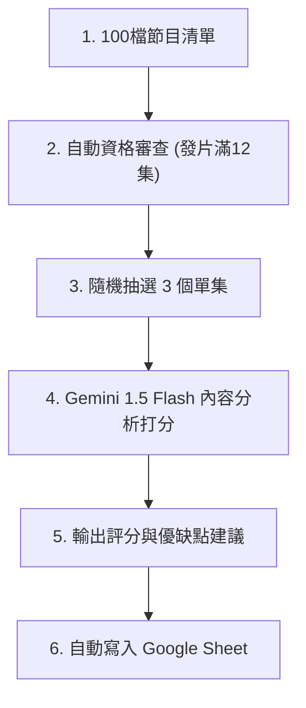
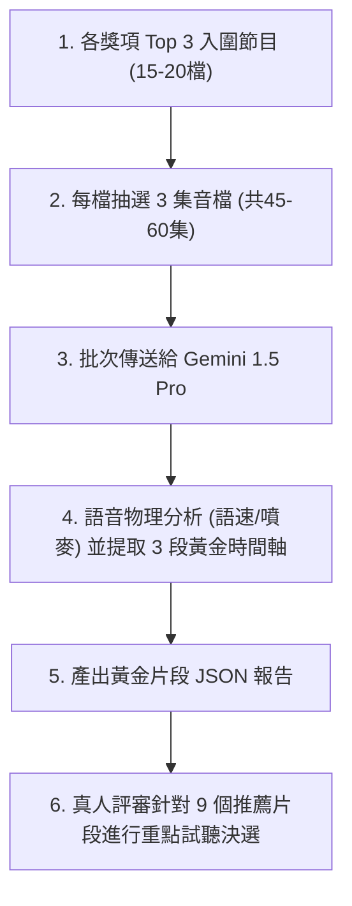
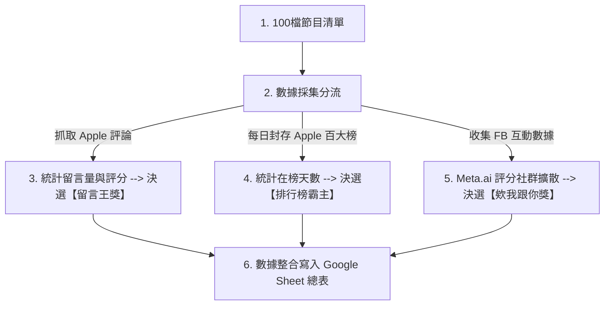

# SDH Award Podcast AI 評選工作流與時程成本規劃書 (Updated)

本規劃書專為**「無程式背景、每天限用筆電執行 2 小時」**的硬體與時間限制所設計。為確保筆電不發熱、不卡頓，且能在 1 小時內全自動完成，本方案推薦採用 **「雲端 API 直聽免轉寫」** 的架構。

---

## 🏆 獎項與評選軌道對照表 (Award-to-Track Mapping Matrix)

大賽的所有獎項已根據其屬性（文字、聲音、外部數據）進行了精準的分軌，避免混淆：

| 評選軌道 | 負責任務屬性 | 對應評估之大賽獎項 | 評估依據與數據源 |
| :--- | :--- | :--- | :--- |
| 🪶 **軌道 A** (逐字稿文本分析軌) | **分析「節目內容、口條與串場」** 著重在文字邏輯、企劃創意，以及主持人的口語表達與幫來賓串場做球能力。 | 1. **【最佳內容架構獎】**、**【最神企劃獎】** 2. **【最佳男主持人獎 (第一輪過篩)】** 3. **【最佳女主持人獎 (第一輪過篩)】** 4. **【最佳雙人主持/多人組獎 (第一輪過篩)】** 5. **【動滋動滋獎/推坑王獎 (CTA)】** 6. **【稀有保護動物/自我探索/時間很短獎】** | **單集逐字稿 (ASR Text)** 透過 AI 閱讀逐字稿，評估內容架構、贅字率與串場轉折邏輯。 |
| ♊ **軌道 B** (聲音物理診斷軌) | **分析「節目製播與聲音」** 著重在主持人的發音、語速、音調起伏與雙人接話默契。 | 1. **【好聽好聽獎/耳朵懷孕獎】** 2. **【最佳雙人主持/多人組獎 (聲音默契診斷)】** 3. **【最佳男/女主持人獎 (聲音感染力與語調)】** 4. **【背景超乾淨獎/錄音品質獎】** | **單集原始音檔 (Audio MP3)** 透過 Gemini 1.5 Pro 直聽音檔，分析語音特徵、默契並提取黃金推薦片段。 |
| 📊 **軌道 C** (社群擴散與數據軌) | **分析「外部傳播與社群」** 著重在聽眾主動回饋（評論留言）與社群傳播熱度。 | 1. **【欸我跟你獎/社群分享力獎】** 2. **【熱心觀眾獎/留言王獎】** | **聽眾評論與 FB 社群數據** 抓取 Apple Podcasts 真實聽眾評論，並利用 Meta.ai 分析 FB 推廣文案留言熱度。 |

---

## 🎯 複審決選：各獎項 Top 3 聲音診斷與黃金 3 片段規劃

當軌道 A 與 C 評選出各獎項 of **Top 3 入圍名單**後（去重後約為 **15 至 20 檔節目**），我們針對這批「入圍決選節目」進行深度的聲音物理診斷與黃金時間軸提取。

為了更全面且客觀地評估主持人的聲音特質與節目表現，**每個入圍節目需要評估 3 個不同單集，且每一集均由 AI 建議 3 段黃金試聽片段**（即每個入圍節目將提供共 9 段黃金片段，供真人評審針對重點進行試聽）。

### 1. 執行工具：Gemini 1.5 Pro API (直聽音檔)
*   **為什麼適合您**：雖然每檔節目評估集數增加至 3 集（總計約 45 至 60 集），但由於我們將音檔網址直接送給 Gemini 1.5 Pro 進行雲端並行處理，因此**依然能在 10 分鐘左右全自動分析完畢**，完全不佔用您本機的運算資源。
*   **預估成本**：Gemini 1.5 Pro 音訊 API 費率為 $0.0075 美元/分鐘。
    *   `60 集 × 40 分鐘 = 2400 分鐘`
    *   `總花費 = 2400 × 0.0075 = $18.00 美元` (約 **新台幣 580 元**)，仍在非常經濟實惠的範圍。

### 2. AI 診斷內容 (寫入 JSON/試算表)
我們要求 Gemini 針對入圍節目所選出的**每一集**輸出以下結構化欄位：
*   **【聲音特徵與音調建議】**：分析主持人的語速（字/分鐘）、音調波動、噴麥/雜音情況，並提供聲音製播建議。
*   **【每集最建議聽的 3 段時間軸】**：針對該單集，精確定位出 **3 段最值得聽的 3 分鐘精華區間**，並說明原因：
    1.  **片段 A (如 12:15 - 15:15)**：【內容火花段】（此段訪談問題切入極深，來賓分享了未曾公開的故事）。
    2.  **片段 B (如 22:30 - 25:30)**：【默契流暢段】（雙人互動極為自然，包含一次溫馨的共鳴笑聲）。
    3.  **片段 C (如 38:00 - 41:00)**：【陪伴療癒段】（語速降至 180 字/分，語氣平穩誠懇，具備強大治癒感）。

### 3. 人類終審 Google Sheet 呈現方式 (真人評審聽重點)
評審不需盲聽 15-20 檔節目共 30-40 小時的原始音檔，只需打開試算表：
*   點選各獎項頁面，查看 Top 3 節目（每個節目 3 集，每集 3 片段，共 9 片段）。
*   點擊試算表內提供的 **[播放片段 A]**、**[播放片段 B]**、**[播放片段 C]** 連結，只聽 3 分鐘精華。
*   真人評審在 **每檔節目 10-15 分鐘** 的聽評過程中即可做出極具信服力的最終評審決定。

---

## 三軌評估時間、成本與負載矩陣 (以 240 集 / 80 檔節目計算)

| 評估軌道 | 推薦實作做法 (對無背景筆電用戶最佳) | 預估執行時間 | 預估資金成本 (新台幣) | 筆電硬體負載 |
| :--- | :--- | :--- | :--- | :---: |
| **軌道 A** (逐字稿文本分析) | **Gemini 1.5 Flash API 雲端直聽打分** 直接將 240 集 MP3 音檔網址傳給 Gemini，免去轉寫步驟，AI 在雲端邊聽邊評分。 | **30 ~ 45 分鐘** (並行處理) | **約 NT$ 400 元** (按音訊分鐘計費) | **0%** (雲端運算) |
| **軌道 B** (複審決選: 各獎項 Top 3 推薦收聽片段) | **Gemini 1.5 Pro API 聲音特徵與片段提取** 針對各獎項 **Top 3 入圍節目**（約 15-20 檔），**每檔評估 3 集**（共 45-60 集音檔）進行音質、默契診斷與每集各 3 段黃金時間軸提取。 | **8 ~ 12 分鐘** (並行處理) | **約 NT$ 430 ~ 580 元** (按音訊分鐘計費) | **0%** (雲端運算) |
| **軌道 C** (外部數據與社群) | **Node.js 輕量爬蟲工具** 一鍵調用 Apple Podcasts Reviews API 與 Spotify 網頁抓取評分。 | **2 分鐘內** | **NT$ 0 元** (完全免費) | **1%** (微量頻寬) |
| **總計** | **一鍵啟動自動化流程** | **60 分鐘內跑完** | **約 NT$ 830 ~ 980 元** | **安全不發熱** |

---

## 🪶 軌道 A：逐字稿文本分析與企劃軌 (Mermaid 流程圖)

此軌道專注於「節目內容架構與企劃」，包含自動化資格審查、音檔下載、雲端 ASR 文本轉寫與評分。

---

## ♊ 軌道 B：音檔物理特徵分析與診斷軌 (複審決選建議 & Mermaid 流程圖)

此軌道評估聲音的物理特性、主持人默契與雜訊。在複審決選階段，針對各獎項 Top 3 節目，評估其隨機抽取的 3 個單集（每集定位 3 個推薦片段，共 9 片段）。

### 🎙️ 雙人與個人主持人之 AI 評鑑指標與評分細則

針對 **【最佳雙人主持/多人組獎】**、**【最佳男主持人獎】** 與 **【最佳女主持人獎】**，系統建立以下結合文本（第一輪）與聲音（第二輪）的評分體系：

#### 1. 最佳雙人/多人主持組獎 (Duo & Group Award)
*   **第一輪文字稿過篩 (軌道 A)**：
    *   **發言結構均衡度 (50%)**：評估兩位主持人的發言比例是否合理平衡（如 `45:55` 至 `50:50`）。若單人發言比例超過 `80:20` 則扣分。
    *   **接話與對話火花 (50%)**：評估兩人互動時，第二主持人接話是提供「幽默吐槽、延伸觀點或精彩做球」，還是流於生硬的「嗯、對、沒錯」機械式回應。
*   **第二輪聲音默契診斷 (軌道 B)**：
    *   **共鳴笑聲同步率**：偵測兩位主持人是否在相同時間軸中出現「同步共鳴笑聲」，這是判斷默契流暢度的物理聲學基礎。
    *   **插話搶話與空白檢測**：自動檢測是否頻繁搶話、打斷他人發言，或出現 1.5 秒以上的無聲死寂（尷尬空白）。

#### 2. 最佳男/女主持人獎 (Male/Female Host Award)
*   **第一輪文字稿過篩 (軌道 A - 口語表達與串場)**：
    *   **【口語表達能力】 (50%)**：分析發言內容的表達邏輯、詞彙通順度與贅字率（呃、然後、那、就是 的出現頻率）。
    *   **【幫來賓串場控場力】 (50%)**：分析主持人如何進行話題轉折與搭橋。在來賓發言後，主持人能做好球引導、延伸發言並進行精彩總結，展現串場穿針引線的能力。
*   **第二輪聲音感染力與語調 (軌道 B - 聲學與診斷)**：
    *   **語速與音量穩定度**：檢測語速是否穩定在 `180–220 字/分鐘` 舒適區間，音量是否平均無爆音噴麥。
    *   **情感起伏波動 (Pitch Variance)**：分析音調高低起伏，避免像照稿朗讀的平淡語調，判定情感渲染力。
    *   **男/女聲學特徵共鳴**：男聲著重「中低音共鳴度」與聲音厚實感；女聲著重「高音域圓潤度」與溫暖陪伴感，排除刺耳或過扁的頻段。

---

## 📊 軌道 C：外部數據與社群軌 (Mermaid 流程圖)

此軌道聚焦於社群擴散與聽眾反饋。為避免 Spotify 等平台的網頁爬蟲被 IP 阻擋，**目前 MVP 階段僅全自動抓取 Apple Podcasts 的公開評論與每日百大榜單**，並結合 Facebook 推廣貼文的自然留言進行 Meta.ai 講評。

<!-- tab-split -->

# 📌 專案執行現況與 Demo 成果彙整 (2026-06-14 節點)

目前本系統的「Demo 概念驗證」與「自動化數據採集」已成功上線，各模組進度如下：

### 1. 資格審查與合格集數池 (更版完成 ✅)
*   **資料源**：以您 OneDrive 的 `updated_sheet.csv` 最終版 25 檔節目清單為範本。
*   **執行腳本**：[build_episode_pool.js](file:///C:/Users/manma/OneDrive/Documents/Antigrivity/SDH%20Award/build_episode_pool.js)
*   **篩選區間**：**2026/01/01 至 2026/06/30**
*   **成果**：
    *   自動建立包含符合資格單集的完整資料庫 [eligible_episodes_pool.csv](file:///C:/Users/manma/OneDrive/Documents/Antigrivity/SDH%20Award/eligible_episodes_pool.csv)，每個單集均包含 GUID 音檔抓取碼。
    *   以下為本次評選區間的自動化資格審查統計總表：

<!-- ELIGIBILITY_START -->

| 序號 | 合作夥伴 | 節目名稱 | 2026上半年發片量 | 資格判定 | 備註 |
| :---: | :--- | :--- | :---: | :---: | :--- |
| 🥇 | 郝旭烈/郝聲音 | 郝聲音 | **175** | ✅ 合格 | 合格 |
| 🥈 | 五吉郎 | 五吉郎 | **121** | ✅ 合格 | 合格 |
| 🥉 | 精算媽咪的家計簿｜珊迪兔 | 精算媽咪的家計簿 | **75** | ✅ 合格 | 合格 |
| 4 | 不敗教主-陳重銘 | 不敗教主陳重銘 | **69** | ✅ 合格 | 合格 |
| 5 | 布姐陪你聰明工作創意生活 | 布姐的沙發 | **63** | ✅ 合格 | 合格 |
| 6 | 瓦基閱讀前哨站 | 下一本讀什麼？ | **60** | ✅ 合格 | 合格 |
| 7 | 蕭邦 | 蕭邦相談室 | **52** | ✅ 合格 | 合格 |
| 8 | Dr Selena | 小資變有錢｜Dr.Selena生活理財王 | **50** | ✅ 合格 | 合格 |
| 9 | 林程揚｜Hank大叔 / 維琪的幸福叮嚀 | 能量黑客 | **48** | ✅ 合格 | 合格 |
| 10 | 胡咪老師 | 分手的99個理由 | **48** | ✅ 合格 | 合格 |
| 11 | Vito大叔 | 粉紅地獄辛辣麵 | **47** | ✅ 合格 | 合格 |
| 12 | 宋家小館｜Becky | 宋家小館 | **42** | ✅ 合格 | 合格 |
| 13 | 梁哲維 | OHMYBOOK｜哲維說書 | **42** | ✅ 合格 | 合格 |
| 14 | 尼可這樣說 | 尼可這樣說 | **39** | ✅ 合格 | 合格 |
| 15 | 我的動齡限量版 | 我的動齡限量版 | **37** | ✅ 合格 | 合格 |
| 16 | 哇賽心理學_蔡宇哲 | 哇賽心理學 | **37** | ✅ 合格 | 合格 |
| 17 | 美股夢想家 | 夢想家說股事 | **36** | ✅ 合格 | 合格 |
| 18 | GK爸爸 | GK爸爸原創故事繪本 | **33** | ✅ 合格 | 合格 |
| 19 | 30節約男子 | 財富餐車不打烊 | **30** | ✅ 合格 | 合格 |
| 20 | 美業幹什麼｜蔡佩陵 | 美業幹什麼 | **29** | ✅ 合格 | 合格 |
| 21 | 無所不試無樂不作 | 無所不試 無樂不作 | **29** | ✅ 合格 | 合格 |
| 22 | 美股航海王 | 航海王的富人學 | **28** | ✅ 合格 | 合格 |
| 23 | 加班當爸媽．櫻桃可可CherryCoco | 加班當爸媽｜櫻桃可可CherryCoco | **26** | ✅ 合格 | 合格 |
| 24 | 聲音表達講師林依柔 | 說話人聲 | **26** | ✅ 合格 | 合格 |
| 25 | 丁菱娟 | 丁菱娟的邊走邊想 | **25** | ✅ 合格 | 合格 |
| 26 | 莫菲穿搭 | 【莫轉台】-試穿新人生 | **25** | ✅ 合格 | 合格 |
| 27 | 楊月娥（楊肉爐） | 楊肉盧 | **25** | ✅ 合格 | 合格 |
| 28 | 山姆書書 | 山姆書書 | **24** | ✅ 合格 | 合格 |
| 29 | 主播/主持人朱楚文 | 科技領航家 | **24** | ✅ 合格 | 合格 |
| 30 | 別人的工作最有趣｜Fiona | 別人的工作最有趣 | **24** | ✅ 合格 | 合格 |
| 31 | 玩命之徒｜林尚諾大師兄 | 玩命之徒 | **24** | ✅ 合格 | 合格 |
| 32 | 閱讀聊樂key | 閱讀聊樂KEY | **24** | ✅ 合格 | 合格 |
| 33 | 蘇絢慧分享空間 | 蘇心時光 | **24** | ✅ 合格 | 合格 |
| 34 | 爛泥媽媽的重生日記（Jill) | 爛泥Jill式優雅 | **24** | ✅ 合格 | 合格 |
| 35 | 張忘形 | 人類行為研究社 | **23** | ✅ 合格 | 合格 |
| 36 | Fire人生大學｜道哥 | FIRE 人生大學 | **21** | ✅ 合格 | 合格 |
| 37 | 小思大維｜雪柔 | 小思大維 | **19** | ✅ 合格 | 合格 |
| 38 | 品牌女子A娜 | 你也想紅嗎 | **19** | ✅ 合格 | 合格 |
| 39 | 姐姐不想懂事了｜莉安君怡 / 姊姊不想懂事了 | 《姐姐不想懂事了》 | Soft Rebellion | **18** | ✅ 合格 | 合格 |
| 40 | 治療師瑪奇 | 教出你的路 | **18** | ✅ 合格 | 合格 |
| 41 | 孫治華 | 人生挖挖WoW-企業人生策略學 | **17** | ✅ 合格 | 合格 |
| 42 | 聰明主婦的生活投資學 | 聰明生活投資學 | **17** | ✅ 合格 | 合格 |
| 43 | 文森說書 | 文森說書 | **16** | ✅ 合格 | 合格 |
| 44 | 孫子玲 | 子玲的親子聊心屋-媽咪的自我成長&親子教養 | **16** | ✅ 合格 | 合格 |
| 45 | 王琄 | 琄蜜莉的異想世界 | **14** | ✅ 合格 | 合格 |
| 46 | 佐依Zoey | 佐編茶水間 | **14** | ✅ 合格 | 合格 |
| 47 | 即薑抵達｜薑咪 | 即薑抵達 | **11** | ❌ 資格不符 | 資格不符 (發片集數不足 12 集) |
| 48 | 潘思璇ＣＰ | CP有主見 | **11** | ❌ 資格不符 | 資格不符 (發片集數不足 12 集) |
| 49 | 小河馬媽媽 | 來晚無添加河粉吧！ | **9** | ❌ 資格不符 | 資格不符 (發片集數不足 12 集) |
| 50 | 鄧惠文 | 鄧惠文 不想說 | **9** | ❌ 資格不符 | 資格不符 (發片集數不足 12 集) |
| 51 | 慢活夫妻Dewi&George | 慢活夫妻－專業美股投資與理財 | **8** | ❌ 資格不符 | 資格不符 (發片集數不足 12 集) |
| 52 | 崔咪 | 一不小心太漂亮 | **7** | ❌ 資格不符 | 資格不符 (發片集數不足 12 集) |
| 53 | 微光中的貓| Claire Hsiao | 《 微光中的北極星 》人生策略、自我成長、內在力量 | **7** | ❌ 資格不符 | 資格不符 (發片集數不足 12 集) |
| 54 | 育兒專機｜犬媽 / 犬兒媽咪の育兒手帳 | 育兒專機 | **4** | ❌ 資格不符 | 資格不符 (發片集數不足 12 集) |
| 55 | 廣播主持人_楊凱涵 | 請多包涵 / BaoHan Talk | **4** | ❌ 資格不符 | 資格不符 (發片集數不足 12 集) |
| 56 | 林慧 | 做自己很難嗎？ | **2** | ❌ 資格不符 | 資格不符 (發片集數不足 12 集) |
| 57 | 喬王的投資理財筆記 | 斜槓 槓槓槓 | **2** | ❌ 資格不符 | 資格不符 (發片集數不足 12 集) |
| 58 | 樂筆 | 歡迎光臨 | **2** | ❌ 資格不符 | 資格不符 (發片集數不足 12 集) |
| 59 | 人生啊！小歐 | 無 | **0** | ❌ 資格不符 | 資格不符 (無 Podcast 節目) |
| 60 | 下半場陪談師＿張嘉茹老師 | 無 | **0** | ❌ 資格不符 | 資格不符 (無 Podcast 節目) |
| 61 | 布萊恩老師 | 無 | **0** | ❌ 資格不符 | 資格不符 (無 Podcast 節目) |
| 62 | 幼兒情緒教育學院-萬叔的心café | 無 | **0** | ❌ 資格不符 | 資格不符 (無 Podcast 節目) |
| 63 | 全遠距工作的行銷人|Coco | 無 | **0** | ❌ 資格不符 | 資格不符 (無 Podcast 節目) |
| 64 | 李柏鋒的擴大機 | 聽進理投 | **0** | ❌ 資格不符 | 資格不符 (發片集數不足 12 集) |
| 65 | 阿駿日常 | 無 | **0** | ❌ 資格不符 | 資格不符 (無 Podcast 節目) |
| 66 | 迷途艾比 | 迷途星球 | **0** | ❌ 資格不符 | 資格不符 (發片集數不足 12 集) |
| 67 | 高言值表達力教練｜竺宥璋｜小竺 | 無 | **0** | ❌ 資格不符 | 資格不符 (無 Podcast 節目) |
| 68 | 張書書 | 無 | **0** | ❌ 資格不符 | 資格不符 (無 Podcast 節目) |
| 69 | 斜槓空姐cindy | 無 | **0** | ❌ 資格不符 | 資格不符 (無 Podcast 節目) |
| 70 | 曼蒂歐逆-轉型之路 | 無 | **0** | ❌ 資格不符 | 資格不符 (無 Podcast 節目) |
| 71 | 莊舒涵（卡姊） | 我不是病人，我是卡姊！ | **0** | ❌ 資格不符 | 資格不符 (發片集數不足 12 集) |
| 72 | 雷浩斯價值投資網 | 無 | **0** | ❌ 資格不符 | 資格不符 (無 Podcast 節目) |
| 73 | 瑪那熊諮商心理師 | 無 | **0** | ❌ 資格不符 | 資格不符 (無 Podcast 節目) |
| 74 | 趙函穎的營養健康週報 | 趙函穎的營養健康報報 | **0** | ❌ 資格不符 | 資格不符 (發片集數不足 12 集) |
| 75 | 劉亦酉 | 無 | **0** | ❌ 資格不符 | 資格不符 (無 Podcast 節目) |
| 76 | 謎卡Mika Lin | 米米說 | **0** | ❌ 資格不符 | 資格不符 (發片集數不足 12 集) |
| 77 | 蘋果老師 | 網紅，紅什麼 | **0** | ❌ 資格不符 | 資格不符 (發片集數不足 12 集) |
| 78 | Coco｜全遠距工作的行銷人 | 無 | **0** | ❌ 資格不符 | 資格不符 (無 Podcast 節目) |
| 79 | Cynthia Huang黃馨儀 | 媽媽好神經病 | **0** | ❌ 資格不符 | 資格不符 (發片集數不足 12 集) |

<!-- ELIGIBILITY_END -->

### 2. 軌道 B 聲音物理測試環境 (完成 ✅)
*   **執行腳本**：[track_b_run.js](file:///C:/Users/manma/OneDrive/Documents/Antigrivity/SDH%20Award/track_b_run.js)
*   **成果**：已寫好完整 API 對接流程（音檔下載 -> 上傳 Gemini Files API -> Pro 模型語音打分與 3 段黃金片段定位）。金鑰申請與設定方式已在 [README.md](file:///C:/Users/manma/OneDrive/Documents/Antigrivity/SDH%20Award/README.md) 中完整指引。

### 3. 軌道 C 聽眾留言量排行榜 (完成 ✅)
*   **執行腳本**：[track_c_run.js](file:///C:/Users/manma/OneDrive/Documents/Antigrivity/SDH%20Award/track_c_run.js)
*   **成果**：完全免付費，成功爬取 16 檔合格節目的聽眾留言數並進行排行。
    *   *例：【美股航海王】13 筆留言奪冠；【哇賽心理學】7 筆留言居次，且自動節錄了真實的語意評論。*

### 4. 軌道 C 百大榜單「每日底層封存」系統 (啟動 ✅)
*   **執行腳本**：[daily_ranking_logger.js](file:///C:/Users/manma/OneDrive/Documents/Antigrivity/SDH%20Award/daily_ranking_logger.js)
*   **排程設定**：已在 Windows 系統成功註冊每日定時工作 `SDH_Podcast_Daily_Ranking_Logger`（每天早上 10:00 自動執行，若關機則開機後補跑）。
*   **成果**：每日自動抓取 Apple Podcasts 台灣區完整 Top 100 榜單，寫入 [daily_top100_archive.csv](file:///C:/Users/manma/OneDrive/Documents/Antigrivity/SDH%20Award/daily_top100_archive.csv)。
    *   *此做法可防範未來參賽清單有新節目加入時，能夠溯及既往地查詢其在榜歷史天數與名次。*

### 5. 🏆 Apple Podcasts 榜單歷史排行 (霸榜統計) [NEW]
*   **統計期間**：自首日收錄起迄今。
*   **成果**：分析歷史備份榜單，統計出 KOL 節目的在榜天數、在榜率以及平均/最佳名次。

<!-- RANKING_START -->

| 名次 | 合作夥伴 | 節目名稱 | 在榜天數 | 在榜率 | 平均排名 | 最佳排名 | 歷史名次軌跡 |
| :---: | :--- | :--- | :---: | :---: | :---: | :---: | :--- |
| 🥇 | 瓦基閱讀前哨站 | 下一本讀什麼？ | **4** | 100% | #26.8 | #23 | 06-14(#31), 06-15(#26), 06-16(#27), 06-17(#23) |
| 🥈 | 哇賽心理學_蔡宇哲 | 哇賽心理學 | **4** | 100% | #28 | #24 | 06-14(#30), 06-15(#24), 06-16(#26), 06-17(#32) |
| 🥉 | 郝旭烈/郝聲音 | 郝聲音 | **4** | 100% | #47.5 | #41 | 06-14(#47), 06-15(#46), 06-16(#41), 06-17(#56) |
| 4 | GK爸爸 | GK爸爸原創故事繪本 | **4** | 100% | #48.5 | #37 | 06-14(#43), 06-15(#37), 06-16(#57), 06-17(#57) |
| 5 | 別人的工作最有趣｜Fiona | 別人的工作最有趣 | **2** | 50% | #88.5 | #79 | 06-14(#79), 06-15(#98) |
| 6 | 文森說書 | 文森說書 | **2** | 50% | #92 | #91 | 06-14(#91), 06-15(#93) |

<!-- RANKING_END -->

### 🛡️ 防 AI 幻覺與數據反查審計機制 (Anti-Hallucination & Verification Guardrails)

為確保系統產出數據的絕對真實性，本專案已建立以下反查限制機制：
1. **每日榜單原始快照 (Apple Chart Audit)**：`daily_ranking_logger.js` 每天在寫入 CSV 之前，會將從 Apple 伺服器取得的 **原始 Raw JSON 回應** 存檔至 `Meta.AI/snapshots/` 資料夾（如 `2026-06-15_raw.json`），並寫入 `ranking_audit.log`，防範人工篡改或寫入遺漏，作為不可篡改的原始證據。
2. **第一輪文字評分精確引用 (Track A Citation Guardrails)**：在軌道 A 企劃評估中，限制 AI 的所有評分均必須輸出逐字稿中大於 10 個字的「精確原文引文（Citations）」，系統以程式在逐字稿中反查引文，若查無引文則評語無效。
3. **第二輪音檔時間軸句頭尾驗證 (Track B Timestamp Guardrails)**：將模型參數設為 `temperature: 0` 確保確定性。AI 定位黃金 3 分鐘時，必須精確輸出該片段「開頭第一句話」與「結束最後一句話」，由系統反查逐字稿，以驗證時間軸是否偏離或有幻覺。

### 📋 MVP 測試與待辦清單 (MVP Testing To-Do List)

目前系統處於 MVP（最小可行性產品）驗證階段，各模組測試與待辦狀態如下：

*   **[x] 資格審查與合格集數池 (`build_episode_pool.js`)**：已測試，完成 16 檔合格節目篩選，產出 733 集集數池。
*   **[x] 軌道 B 聲音物理測試 (`track_b_run.js`)**：已測試，使用單一短音檔成功完成 Files API 上傳、語速分析、噴麥檢測與黃金片段提取。
*   **[x] 軌道 C Apple Podcasts 評論抓取 (`track_c_run.js`)**：已測試，成功全自動抓取並產出留言排行榜。
*   **[x] 軌道 C 百大榜單每日封存排程 (`daily_ranking_logger.js`)**：已測試，成功註冊 Windows 每日 10:00 自動執行任務。
*   **[ ] 軌道 A 內容企劃大批量打分測試 (待辦 ⏳)**：尚未撰寫大批量 MP3 轉 Flash API 打分腳本。
*   **[ ] 決選隨機抽樣系統 (`draw_samples.js` 或整合功能) (待辦 ⏳)**：尚未撰寫自動化抽樣程式。
*   **[ ] 軌道 B 80 檔節目大批量 (240 集) 聲音物理評估測試 (待辦 ⏳)**：
    *   *評估設計*：若要將全體 80 檔節目皆進行軌道 B 聲音物理評定（每檔 3 集，共 240 集音檔），系統將透過 Node.js 進行批次上傳（分流並行）。
    *   *預估處理時間*：約 **25 ~ 35 分鐘**（全雲端運算，本機 0 負載，僅需等待上傳頻寬）。
    *   *預估 API 成本*：`80 檔 × 3 集 × 40 分鐘/集 = 9,600 分鐘`，`9,600 分鐘 × $0.0075 美元 = $72.00 美元`（約 **新台幣 2,300 元**）。
*   **[ ] 終審 Google Sheets 儀表板自動化整合 (待辦 ⏳)**：尚未撰寫將三軌數據合併自動填入 Google Sheets 的 Google Apps Script 或 Node 腳本。

<!-- tab-split -->

# ⏳ 專案開發與進程時間軸 (Project Timeline)

這裡記錄了 SDH Award Podcast AI 評選系統的開發動態與更新日誌，按日期排序，越新的動態顯示在最上方。

---

### 📅 2026-06-15 (主題：雙人/男女主持人 AI 指標實作與防評選幻覺更版)
*   **🎙️ 主持人 AI 評鑑標準確認**
    *   **軌道 A 文本分析**：納入「口語表達能力 (50%)」與「幫來賓串場控場力 (50%)」作為第一輪文字稿評審細則。
    *   **軌道 B 聲音物理**：納入語速波動、音調起伏、男低音共鳴與女高音溫馨感等第二輪聲音評選指標。
    *   **腳本更新**：已在 `track_b_run.js` 中成功更新 Prompt 與輸出 JSON 欄位。
*   **🛡️ 三大防 AI 幻覺與數據反查機制**
    *   **每日榜單**：保存 Apple Podcasts 每日排行榜的原始 Raw JSON 響應快照，建立 `ranking_audit.log` 防篡改審計。
    *   **軌道 A 文字**：限制 AI 所有評分必須包含大於 10 字的精確引文，程式自動在逐字稿中反查引文真偽。
    *   **軌道 B 音檔**：將模型參數設為 `temperature: 0` 極大化確定性，要求 AI 輸出黃金時間軸首尾句字元以供反查。
*   **🌐 主網頁結構重構 (隔離嵌入)**
    *   將 Meta.AI 總評網頁以 `<iframe>` 隔離載入，完美阻絕 CSS 衝突，100% 還原米色紙質高級感的原始設計。

---

### 📅 2026-06-15 (主題：軌道三 (Meta.AI) 儀表板整合與版面優化)
*   **📊 軌道 C (Meta.AI) 社群聲量大數據整合**
    *   **異動內容**：將 Meta.ai 評選出的「鬧鐘獎［欸我跟你獎］社群聲量總講評」HTML 動態報告，完全整合至本規劃書網頁中，作為獨立的第三頁籤 **「📊 軌道 C 社群聲量」**。
    *   **版面優化**：主版面升級為 **「三頁籤 -> 四頁籤」**（規劃書/現況/社群聲量/時間軸），並優化行動端按鈕顯示。
    *   **數據補正**：針對社群聲量表單進行結構修復，補齊 `<thead>` 中的 **「建議執行動作」** 標題列，修復資料欄位對齊問題。

---

### 📅 2026-06-14 (主題：軌道建立與 MVP Demo 測試)
*   **♊ 軌道 B 決選打分邏輯升級**
    *   **異動內容**：為提高評審的客觀性，將各獎項 Top 3 入圍節目的評估方式，由「僅評估 1 個單集（產出 3 段黃金片段）」調整為**「每檔節目評估 3 個單集，每集建議 3 段黃金片段（共 9 段精華片段）」**。
    *   **連動更新**：重新估算複審 API 的預算（NT$ 430 ~ 580 元）及總體執行時間（小於 60 分鐘），更新規劃書數據。
*   **⚙️ 每日排行日誌 logger 啟動**
    *   成功部署 `daily_ranking_logger.js` 排程腳本，並在 Windows 系統註冊 `SDH_Podcast_Daily_Ranking_Logger` 每日工作排程，每天早上 10:00 自動下載封存 Apple Podcasts 台灣區完整 Top 100 榜單。
*   **📊 軌道 C 聽眾留言量排行榜上線**
    *   完成 `track_c_run.js` 開發，透過 Apple Podcasts Reviews API 成功抓取 16 檔合格節目的聽眾留言數並進行排行。
*   **♊ 軌道 B 聲音物理特徵測試成功**
    *   完成 `track_b_run.js` 開發，順利對接 Gemini Files API 進行 MP3 音檔上傳、分析語調語速，並成功定位黃金 3 分鐘。
*   **🔍 資格審查與合格集數池建立**
    *   完成 `build_episode_pool.js` 開發，以 6 個月發片滿 12 集為門檻，從 24 檔節目中篩選出 16 檔合格節目，並建立 733 集的合格集數池資料庫（`eligible_episodes_pool.csv`）。
*   **🌐 建議書靜態網頁與 Git 儲存庫建立**
    *   建立 `generate_html.js` 自動化 HTML 轉換工具。
    *   設定專案 GitHub 遠端儲存庫，成功推送首版規劃書並準備啟用 GitHub Pages 固定網址。

---

### 📅 2026-06-13
*   **🏗️ 專案初始化與三軌架構設計**
    *   確定 SDH Award 的評選軌道對照表（軌道 A 文本分析、軌道 B 聲音物理、軌道 C 外部社群數據）。
    *   設計無程式背景、限用筆電 2 小時、0 發熱的「雲端 API 直聽」核心架構。
