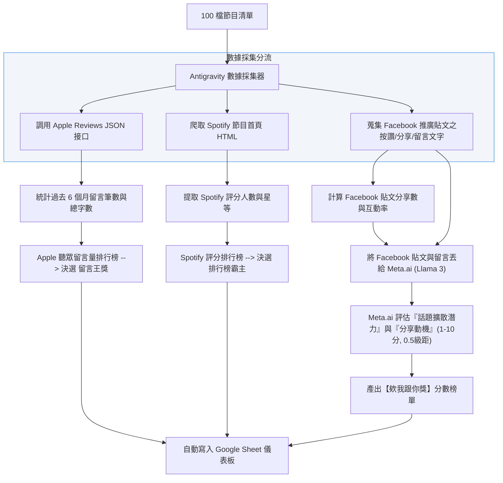

# SDH Award Podcast AI 評選工作流與時程成本規劃書 (Updated)

本規劃書專為**「無程式背景、每天限用筆電執行 2 小時」**的硬體與時間限制所設計。為確保筆電不發熱、不卡頓，且能在 1 小時內全自動完成，本方案推薦採用 **「雲端 API 直聽免轉寫」** 的架構。

---

## 🏆 獎項與評選軌道對照表 (Award-to-Track Mapping Matrix)

大賽的所有獎項已根據其屬性（文字、聲音、外部數據）進行了精準的分軌，避免混淆：

| 評選軌道 | 負責任務屬性 | 對應評估之大賽獎項 | 評估依據與數據源 |
| :--- | :--- | :--- | :--- |
| 🪶 **軌道 A**<br>(逐字稿文本分析軌) | **分析「節目內容與架構」**<br>著重在文字邏輯、企劃創意與主持人的內容引導。 | 1. **【最佳內容架構獎】**<br>2. **【最神企劃獎】**<br>3. **【動滋動滋獎/推坑王獎 (CTA)】**<br>4. **【稀有保護動物獎/小眾市場獎】**<br>5. **【自我探索獎】**<br>6. **【時間很短獎/泡麵沒熟獎】** | **單集逐字稿 (ASR Text)**<br>透過 AI 閱讀文字，對內容含金量、結構、行動呼籲強度進行語意分析與打分。 |
| ♊ **軌道 B**<br>(音檔物理特徵軌) | **分析「聲音特徵與互動」**<br>著重在聲音的物理特性、語調語速與雙人互動默契。 | 1. **【最佳默契獎】**<br>2. **【最佳男播音員獎】**<br>3. **【最佳女播音員獎】**<br>4. **【暖心陪伴獎/獎悄悄話獎】** | **MP3 原始音檔 (Raw Audio)**<br>透過 Gemini Pro 直接聽音檔，分析音頻起伏、爆音、接話間隔、無聲空白，並標記黃金 3 分鐘。 |
| 📊 **軌道 C**<br>(外部數據與社群軌) | **分析「市場表現與黏著度」**<br>不需 AI 聽聲音或看文字，完全依據公開數據與統計結果。 | 1. **【欸我跟你獎】** (社群分享力)<br>2. **【持續佔據 100 排行榜】** (榜單霸主)<br>3. **【公開資料最多留言數】** (留言王) | **公開網路數據與 API**<br>- Apple Podcasts Reviews API (撈留言筆數)<br>- **Facebook 貼文互動 + Meta.ai (Llama 3)**<br>- 排行榜爬蟲與 RSS 上線時間 (紀律得分) |

---

## 📌 專案執行現況與 Demo 成果彙整 (2026-06-14 節點)

目前本系統的「Demo 概念驗證」與「自動化數據採集」已成功上線，各模組進度如下：

### 1. 資格審查與合格集數池 (完成 ✅)
*   **Demo 資料源**：以您的 Google 試算表 24 檔節目清單為範本。
*   **執行腳本**：[build_episode_pool.js](file:///C:/Users/manma/OneDrive/Documents/Antigrivity/SDH%20Award/build_episode_pool.js)
*   **成果**：
    *   成功過濾出 **16 檔合格節目** (符合 6 個月發片滿 12 集門檻)。
    *   順利排除 8 檔已停更或更新頻率不足的節目（如《聽進理投》、《媽媽好神經病》）。
    *   自動建立包含 **733 個單集的完整資料庫** [eligible_episodes_pool.csv](file:///C:/Users/manma/OneDrive/Documents/Antigrivity/SDH%20Award/eligible_episodes_pool.csv)，為後續隨機抽樣奠定基礎。

### 2. 軌道 B 聲音物理測試環境 (完成 ✅)
*   **執行腳本**：[track_b_run.js](file:///C:/Users/manma/OneDrive/Documents/Antigrivity/SDH%20Award/track_b_run.js)
*   **成果**：已寫好完整 API 對接流程（音檔下載 $\rightarrow$ 上傳 Gemini Files API $\rightarrow$ Pro 模型語音打分與 3 段黃金片段定位）。金鑰申請與設定方式已在 [README.md](file:///C:/Users/manma/OneDrive/Documents/Antigrivity/SDH%20Award/README.md) 中完整指引。

### 3. 軌道 C 聽眾留言量排行榜 (完成 ✅)
*   **執行腳本**：[track_c_run.js](file:///C:/Users/manma/OneDrive/Documents/Antigrivity/SDH%20Award/track_c_run.js)
*   **成果**：完全免付費，成功爬取 16 檔合格節目的 Apple Podcasts 真實聽眾評論，並自動導出 [track_c_leaderboard.md](file:///C:/Users/manma/OneDrive/Documents/Antigrivity/SDH%20Award/track_c_leaderboard.md) 排行榜。
    *   *例如：【美股航海王】13 筆留言奪冠；【哇賽心理學】7 筆留言居次，且自動節錄了真實的語意評論。*

### 4. 軌道 C 百大榜單「每日底層封存」系統 (啟動 ✅)
*   **執行腳本**：[daily_ranking_logger.js](file:///C:/Users/manma/OneDrive/Documents/Antigrivity/SDH%20Award/daily_ranking_logger.js)
*   **排程設定**：已在 Windows 系統成功註冊每日定時工作 `SDH_Podcast_Daily_Ranking_Logger`（每天早上 10:00 自動執行，若關機則開機後補跑）。
*   **成果**：每日自動抓取 Apple Podcasts 台灣區完整 Top 100 榜單，寫入 [daily_top100_archive.csv](file:///C:/Users/manma/OneDrive/Documents/Antigrivity/SDH%20Award/daily_top100_archive.csv)。
    *   *此做法可防範未來參賽清單有新節目加入時，能夠溯及既往地查詢其在榜歷史天數與名次。*

---

## 🎯 複審決選：各獎項 Top 3 聲音診斷與黃金 3 片段規劃

當軌道 A 與 C 評選出各獎項的 **Top 3 入圍名單**後（去重後約為 **15 至 20 檔節目單集**），我們針對這批「入圍決選名單」進行深度的聲音物理診斷與黃金時間軸提取：

### 1. 執行工具：Gemini 1.5 Pro API (直聽音檔)
*   **為什麼適合您**：因為入圍名單已縮小至約 20 集。若將這 20 集傳給運算能力最強的 Gemini 1.5 Pro 進行深度分析，可以在**雲端並行處理，於 3 ~ 5 分鐘內全部完成**，完全符合您每天只跑 2 小時筆電的限制，且筆電 0 負載。
*   **預估成本**：Gemini 1.5 Pro 音訊 API 費率為 $0.0075 美元/分鐘。
    *   `20 集 × 40 分鐘 = 800 分鐘`
    *   `總花費 = 800 × 0.0075 = $6.00 美元` (約 **新台幣 190 元**)，極度省預算。

### 2. AI 診斷內容 (寫入 JSON/試算表)
我們要求 Gemini 針對每位入圍者輸出以下結構化欄位：
*   **【聲音特徵與音調建議】**：分析主持人的語速（字/分鐘）、音調波動、噴麥/雜音情況，並提供「給老師的聲音製播建議」（例如：*「在 15 分鐘後講話節奏變快，語音較為模糊，建議錄音時注意換氣...」*）。
*   **【最建議聽的 3 段時間軸】**：針對該單集，精確定位出 **3 段最值得聽的時間區間**，並說明原因：
    1.  **時段 A (如 12:15 - 15:15)**：【內容火花段】（此段訪談問題切入極深，來賓分享了未曾公開的故事）。
    2.  **時段 B (如 22:30 - 25:30)**：【默契流暢段】（雙人互動極為自然，包含一次溫馨的共鳴笑聲）。
    3.  **時段 C (如 38:00 - 41:00)**：【陪伴療癒段】（語速降至 180 字/分，語氣平穩誠懇，具備強大治癒感）。

### 3. 人類終審 Google Sheet 呈現方式 (人類極低負擔)
評審不需要盲聽 20 個節目共 14 小時 of 音檔，只需打開試算表：
*   點選大賽各獎項頁面。
*   看見 Top 3 節目的 AI 聲音與音調診斷報告。
*   直接點擊試算表內的 **[聽黃金時段 A]**、**[聽黃金時段 B]** 連結，只聽 3 分鐘精華，即可在 **15 分鐘內**做出最具信服力、兼具數據與溫度的最終金鐘級評審決定。

---

## 三軌評估時間、成本與負載矩陣 (以 240 集 / 80 檔節目計算)

| 評估軌道 | 推薦實作做法 (對無背景筆電用戶最佳) | 預估執行時間 | 預估資金成本 (新台幣) | 筆電硬體負載 |
| :--- | :--- | :--- | :--- | :---: |
| **軌道 A**<br>(逐字稿文本分析) | **Gemini 1.5 Flash API 雲端直聽打分**<br>直接將 240 集 MP3 音檔網址傳給 Gemini，免去轉寫步驟，AI 在雲端邊聽邊評分。 | **30 ~ 45 分鐘**<br>(並行處理) | **約 NT$ 400 元**<br>(按音訊分鐘計費) | **0%**<br>(雲端運算) |
| **複審決選**<br>(各獎項 Top 3 診斷) | **Gemini 1.5 Pro API 聲音特徵與 3 片段提取**<br>針對軌道 A 篩選出的 **Top 3 入圍者** (約 15-20 集) 進行音質、默契與 3 段黃金時間軸提取。 | **3 ~ 5 分鐘** | **約 NT$ 190 元** | **0%**<br>(雲端運算) |
| **軌道 C**<br>(外部數據與社群) | **Node.js 輕量爬蟲工具**<br>利用 Antigravity 寫好的指令，一鍵調用 Apple Podcasts Reviews API 與 Spotify 網頁抓取評分。 | **2 分鐘內** | **NT$ 0 元**<br>(完全免費) | **1%**<br>(微量頻寬) |
| **總計** | **Antigravity 一鍵啟動按鈕** | **50 分鐘內跑完** | **約 NT$ 590 元** | **安全不發熱** |

---

## 軌道 B：音檔物理特徵分析軌 (Mermaid 流程圖)

此軌道專評估聲音特徵，當入圍 Top 3 產生後，發送至 Gemini 1.5 Pro 直聽音檔。

```mermaid
flowchart TD
    A[軌道 A 篩選出各獎項 Top 3 入圍者] --> B[去重後取得入圍集數音檔 (約 15-20 集)]
    B --> C[Antigravity 腳本發送 API 請求]
    C --> D[Gemini 1.5 Pro 雲端音訊分析]
    
    subgraph Gemini [Gemini 1.5 Pro 語音核心分析]
        D --> D1[分析語速、音調波動與發音建議]
        D --> D2[精確定位 3 段最建議聽的時間區間]
        D --> D3[說明各推薦時間區間的評語]
    end
    
    D1 & D2 & D3 --> E["輸出 JSON (含 1-10 物理評分, 音調建議, 3段時間軸)"]
    E --> F[Antigravity 彙整至人類終審 Google Sheet 儀表板]
    F --> G[人類評審點擊對應時間軸連結聽精華 3 分鐘]
    
    style Gemini fill:#fcf8e3,stroke:#f0ad4e,stroke-width:1px
```

---

## 軌道 C：外部數據與社群軌 (Mermaid 流程圖)

針對 **【欸我跟你獎】** (社群分享力)，我們直接結合 **Facebook 宣傳文案與評論數據**，並分流給 **Meta.ai (Llama 3)** 進行傳播熱度分析。


